# DevOps II Sessional (Units III-V)

This file contains 10-mark style answers for all sessional questions using Unit III, IV, and V notes.

---

## Unit III: Jenkins

### Q1(a) Describe the architecture of Jenkins with a neat diagram.

Jenkins follows a controller-worker architecture (historically called master-slave).

1. Jenkins Controller (Master)

- Central server that schedules jobs.
- Manages users, plugins, credentials, and pipelines.
- Distributes jobs to available agents.

2. Agent Nodes (Workers/Slaves)

- Execute build, test, and deployment tasks.
- Can be Linux, Windows, VM, or container based nodes.
- Connected by SSH or JNLP.

3. Executors

- Parallel slots on an agent for running multiple jobs concurrently.

4. Plugins and Integrations

- Connect Jenkins to GitHub, Docker, Maven, JUnit, cloud platforms, etc.

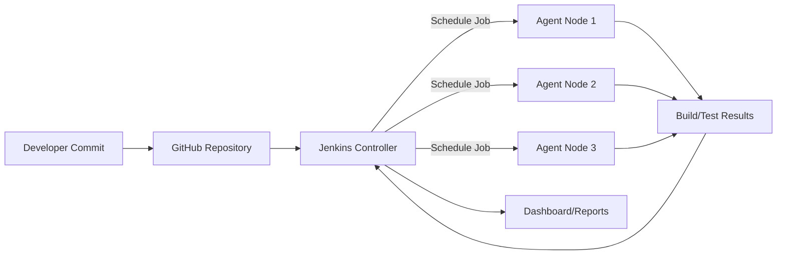

### Q1(b) Describe the roles of Master, Node, Agent, and Executor in Jenkins.

- Master (Controller): Orchestrates the whole CI/CD process, stores job configurations, and decides where a job should run.
- Node: Any machine registered with Jenkins capable of executing tasks.
- Agent: Runtime process on a node that communicates with the controller and performs assigned steps.
- Executor: A processing slot inside a node. If a node has 4 executors, it can run 4 builds in parallel.

---

### Q2(a) Compare Freestyle projects and Pipeline-based jobs in Jenkins.

| Aspect              | Freestyle Project               | Pipeline Job                        |
| ------------------- | ------------------------------- | ----------------------------------- |
| Definition          | UI configured build job         | Code-defined workflow (Jenkinsfile) |
| Version Control     | Limited (XML config in Jenkins) | Full versioning in Git              |
| Complexity Handling | Good for simple jobs            | Best for multi-stage CI/CD          |
| Reusability         | Low                             | High (shared libraries, templates)  |
| Auditability        | Lower                           | Higher (code review + history)      |
| Recommended         | Small/simple setups             | Modern DevOps workflows             |

Conclusion: Pipelines are preferred for maintainability, traceability, and automation at scale.

### Q2(b) Propose a Jenkins pipeline for automating build and test stages.

```groovy
pipeline {
  agent any
  stages {
    stage('Checkout') {
      steps { git url: 'https://github.com/org/repo.git', branch: 'main' }
    }
    stage('Build') {
      steps { sh 'mvn clean package -DskipTests' }
    }
    stage('Test') {
      steps { sh 'mvn test' }
      post {
        always { junit 'target/surefire-reports/*.xml' }
      }
    }
  }
}
```

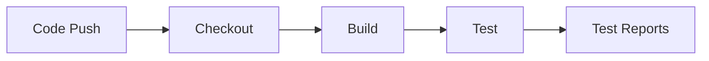

---

### Q3(a) Analyze the advantages of Master-Slave architecture in Jenkins.

1. Horizontal Scalability: add more agents to handle growing workloads.
2. Parallel Processing: execute multiple pipelines simultaneously.
3. Platform Diversity: run jobs on OS-specific agents.
4. Resource Isolation: heavy builds stay away from controller.
5. Better Reliability: failed agent does not stop the whole CI server.
6. Cost Optimization: dynamic cloud agents can be provisioned on demand.

### Q3(b) Create CI pipeline: GitHub -> Jenkins -> Build -> Test -> Docker -> DockerHub -> Deploy (AWS EC2/OpenShift).

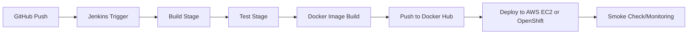

Core steps:

- Webhook triggers Jenkins.
- Jenkins builds and tests app.
- Docker image is created and tagged.
- Image pushed to Docker Hub.
- Deployment script updates running service on AWS EC2 or OpenShift.

---

### Q4(a) Explain the process to create a slave node.

1. Prepare target machine (Java + network access).
2. In Jenkins: Manage Jenkins -> Nodes -> New Node.
3. Select Permanent Agent and set name/labels.
4. Configure remote root directory.
5. Choose launch method (SSH/JNLP).
6. Save and connect.
7. Verify node status and run test job.

### Q4(b) Develop pipeline to launch build on slave node: GitHub -> Jenkins -> Build -> Test -> Deploy (AWS EC2).

```groovy
pipeline {
  agent { label 'linux-slave' }
  stages {
    stage('Checkout') { steps { git 'https://github.com/org/repo.git' } }
    stage('Build') { steps { sh 'mvn clean package -DskipTests' } }
    stage('Test') { steps { sh 'mvn test' } }
    stage('Deploy') { steps { sh './deploy-ec2.sh' } }
  }
}
```

---

### Q5(a) Explain Jenkins workflow from source commit to build execution.

1. Developer commits code to Git repository.
2. SCM webhook notifies Jenkins.
3. Jenkins checks out latest code.
4. Build tools compile/package application.
5. Automated tests run.
6. Reports/artifacts are generated.
7. Optional deployment starts based on pipeline logic.
8. Dashboard displays status and logs.

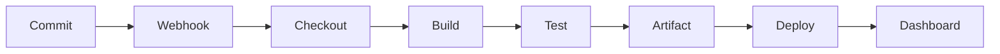

### Q5(b) Demonstrate steps for creating and managing a Jenkins build job.

1. Create New Item -> Freestyle/Pipeline.
2. Configure SCM and branch.
3. Add build triggers (polling/webhook/schedule).
4. Define build commands.
5. Add post-build actions (archive, notifications).
6. Save and run build.
7. Monitor console output and trends.
8. Update configuration as project evolves.

---

### Q6(a) Create a Freestyle project: GitHub connect, build, unit test result on dashboard.

Steps:

1. New Item -> Freestyle Project.
2. Source Code Management -> Git -> repository URL.
3. Build Triggers -> GitHub hook trigger.
4. Build Step -> run Maven/Gradle/NPM test command.
5. Post-build -> Publish JUnit test results.
6. Save and Build Now.

Outcome:

- Jenkins dashboard shows build status and test report trends.

### Q6(b) Explain differences between Declarative and Scripted Jenkins pipeline.

| Aspect      | Declarative Pipeline | Scripted Pipeline             |
| ----------- | -------------------- | ----------------------------- |
| Style       | Structured DSL       | Groovy scripting              |
| Readability | High                 | Medium (flexible but complex) |
| Validation  | Early syntax checks  | Runtime behavior focused      |
| Flexibility | Controlled           | Very high                     |
| Use case    | Standard CI/CD       | Advanced/custom logic         |

---

## Unit IV: Docker and Continuous Delivery

### Q1(a) Illustrate Docker commands to manage images and containers.

Image commands:

- docker pull image
- docker images
- docker build -t app:1.0 .
- docker tag app:1.0 user/app:1.0
- docker push user/app:1.0
- docker rmi image_id

Container commands:

- docker run -d --name app -p 8080:80 user/app:1.0
- docker ps / docker ps -a
- docker logs app
- docker exec -it app sh
- docker stop app
- docker rm app

### Q1(b) Explain how containerization supports DevOps practices.

- Consistency: same environment across dev/test/prod.
- Faster delivery: lightweight and quick startup.
- Microservices alignment: independent packaging/deployment.
- Better CI/CD: easy build-test-deploy automation.
- Scalability: rapid replication and orchestration.
- Rollback support: immutable image tags.

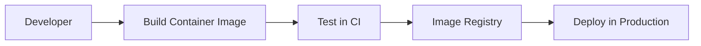

---

### Q2(a) Demonstrate creating and running a Docker container using Dockerfile.

Sample Dockerfile:

```dockerfile
FROM openjdk:17-jdk-slim
WORKDIR /app
COPY target/app.jar app.jar
EXPOSE 8080
ENTRYPOINT ["java", "-jar", "app.jar"]
```

Commands:

1. docker build -t myapp:1.0 .
2. docker run -d --name myapp -p 8080:8080 myapp:1.0
3. docker ps

### Q2(b) Demonstrate Selenium for web application test automation.

Process:

1. Install Selenium and browser driver.
2. Open browser and navigate to target URL.
3. Locate elements and perform actions.
4. Assert expected outcomes.
5. Integrate test execution in CI.

Example (Java/TestNG idea):

- Launch login page.
- Enter username/password.
- Click login.
- Validate successful redirect.

---

### Q3(a) Explain importance of Continuous Delivery in software development.

- Reduces release risk by small frequent changes.
- Improves quality through automated verification.
- Shortens time-to-market.
- Improves incident response and rollback ability.
- Builds confidence with repeatable releases.

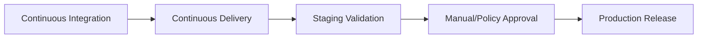

### Q3(b) Explain JavaScript testing tool Jest in detail.

Key features:

- Zero-config setup for JS/TS projects.
- Fast parallel test execution.
- Built-in mocking support.
- Snapshot testing for UI outputs.
- Rich matchers and coverage reports.

Typical Jest flow:

1. Write unit tests for functions/components.
2. Run with npm test.
3. Generate coverage and enforce thresholds.
4. Execute inside CI pipeline.

---

### Q4(a) Build CI/CD pipeline: GitHub -> Build -> Test -> Docker/DockerHub -> Deploy (OpenShift).

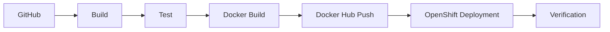

Pipeline explanation:

- Code push triggers CI server.
- Build and test gates must pass.
- Container image is built and pushed.
- OpenShift rollout updates application pods.

### Q4(b) Create a Docker Compose file for web app and database.

```yaml
version: "3.9"
services:
  web:
    image: myorg/webapp:1.0
    ports:
      - "8080:8080"
    environment:
      DB_HOST: db
      DB_NAME: appdb
      DB_USER: appuser
      DB_PASSWORD: apppass
    depends_on:
      - db

  db:
    image: postgres:15
    environment:
      POSTGRES_DB: appdb
      POSTGRES_USER: appuser
      POSTGRES_PASSWORD: apppass
    volumes:
      - db_data:/var/lib/postgresql/data

volumes:
  db_data:
```

---

### Q5(a) Explain Dockerfile instructions with examples.

Important instructions:

- FROM: base image.
- WORKDIR: working folder.
- COPY/ADD: copy files into image.
- RUN: execute command at build time.
- ENV: set environment variables.
- EXPOSE: document application port.
- CMD: default command.
- ENTRYPOINT: fixed executable command.

Example:

```dockerfile
FROM node:20-alpine
WORKDIR /usr/src/app
COPY package*.json ./
RUN npm ci
COPY . .
EXPOSE 3000
CMD ["npm", "start"]
```

### Q5(b) Explain Docker commands in detail.

Categories:

1. Image lifecycle: pull, build, tag, push, rmi.
2. Container lifecycle: run, start, stop, restart, rm.
3. Inspection: ps, logs, inspect, stats, top.
4. Networking and storage: network ls, volume ls, compose up/down.

Best practice:

- Use tagged images.
- Avoid latest in production.
- Keep images small and immutable.

---

## Unit V: Configuration Management, Ansible, Kubernetes, OpenShift

### Q1(a) Define Configuration Management and role of Ansible in DevOps.

Configuration Management is the process of maintaining system/software configuration in a known, controlled, and versioned state.

Role of Ansible:

- Automates provisioning and configuration.
- Agentless architecture using SSH.
- Uses YAML playbooks for readability.
- Supports repeatable, idempotent operations.
- Enables consistent deployments and zero-downtime rollouts.

### Q1(b) Explain purpose of Jinja templating in Ansible with example.

Purpose:

- Dynamically generate configuration files using variables.
- Reuse one template across many servers/environments.
- Reduce manual edits and drift.

Template (nginx.conf.j2):

```jinja2
server {
  listen {{ app_port }};
  server_name {{ server_name }};
  location / {
    proxy_pass http://{{ backend_host }}:{{ backend_port }};
  }
}
```

Playbook task:

```yaml
- name: Render nginx config
  template:
    src: nginx.conf.j2
    dest: /etc/nginx/conf.d/app.conf
```

---

### Q2(a) Write playbook to install Nginx, start and enable service.

```yaml
- name: Install and start Nginx
  hosts: web
  become: true
  tasks:
    - name: Install nginx
      package:
        name: nginx
        state: present

    - name: Start nginx
      service:
        name: nginx
        state: started

    - name: Enable nginx
      service:
        name: nginx
        enabled: true
```

### Q2(b) Deploy a web application using Ansible.

Deployment workflow:

1. Pull source/artifact.
2. Copy build to target hosts.
3. Configure app and web server templates.
4. Restart or reload services.
5. Verify health endpoint.

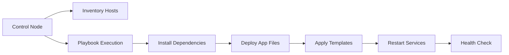

---

### Q3(a) Describe Kubernetes namespaces and resources.

Namespaces:

- Logical partition in a cluster.
- Separate teams/environments (dev, qa, prod).
- Enable policy and quota isolation.

Resources (common):

- Pod, Deployment, ReplicaSet
- Service, ConfigMap, Secret
- StatefulSet, DaemonSet, Job, CronJob
- Ingress, Namespace, ResourceQuota

Benefits:

- Better organization, security boundaries, and resource governance.

### Q3(b) Explain DeploymentConfig and BuildConfig in OpenShift.

BuildConfig:

- Defines how source code becomes container image.
- Supports source-to-image and Docker strategies.
- Triggered by code changes or manually.

DeploymentConfig:

- Defines how images are rolled out to running pods.
- Supports rolling, recreate, hooks, and triggers.

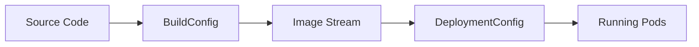

---

### Q4(a) Explain Kubernetes architecture (Master and Worker nodes).

Master (Control Plane):

- API Server: entry point for all operations.
- etcd: cluster state data store.
- Scheduler: assigns pods to nodes.
- Controller Manager: maintains desired state.

Worker Node:

- Kubelet: node agent.
- Container Runtime: runs containers.
- Kube-proxy: networking and service routing.
- Pods: running application units.

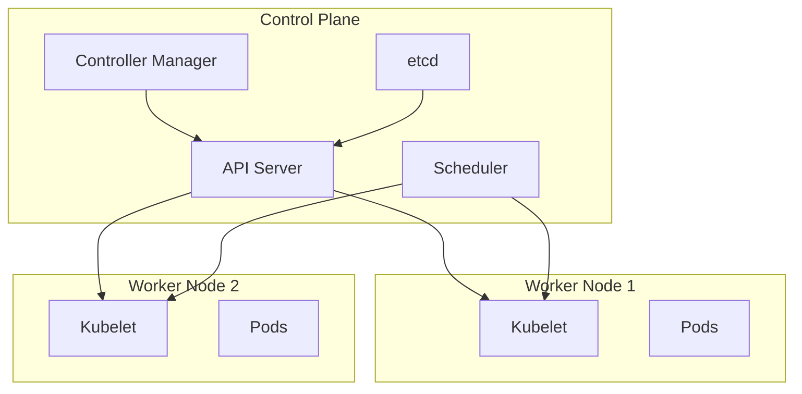

### Q4(b) Explain how to deploy apps on OpenShift container pods.

Steps:

1. Create/Open project namespace.
2. Create BuildConfig or use existing image.
3. Push image to image stream/registry.
4. Create DeploymentConfig or Deployment.
5. Expose service and route.
6. Validate rollout and pod health.
7. Scale replicas as required.

---

### Q5(a) Explain Puppet architecture with diagram: Puppet Master, Puppet Agent, Catalog, Facts.

Puppet architecture components:

- Puppet Master (Server): central configuration authority.
- Puppet Agent: runs on managed nodes.
- Facts: system details collected by agent.
- Catalog: compiled desired state sent by master.

Working:

1. Agent sends facts to master.
2. Master compiles catalog from manifests.
3. Agent receives and enforces catalog.
4. Agent reports status back.

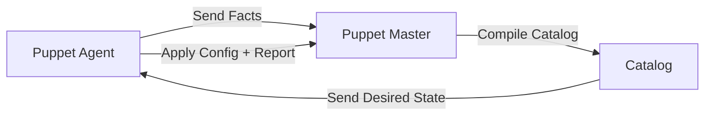

### Q5(b) Explain Chef architecture with diagram.

Chef architecture:

- Workstation: where cookbooks/recipes are authored.
- Chef Server: stores cookbooks, policies, node data.
- Chef Client (Node): pulls policy and converges system.

Flow:

1. Admin writes recipe in workstation.
2. Cookbook uploaded to Chef server.
3. Node chef-client pulls run-list and cookbook.
4. Node converges to desired state and reports.

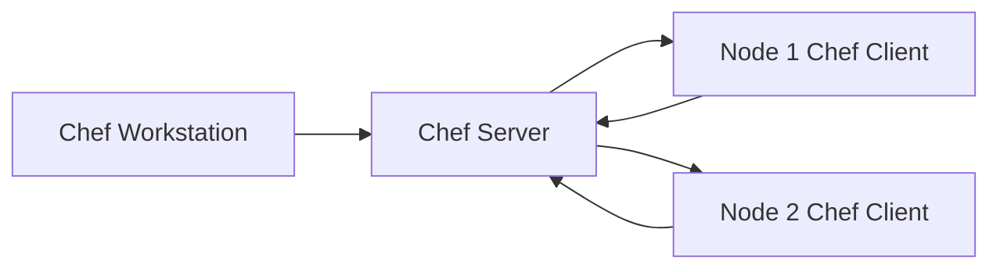

---

### Q6(a) Explain how to install Puppet Master and Agent on two systems.

High-level procedure:

1. Prepare two Linux hosts (one master, one agent).
2. Configure hostnames and DNS/hosts mapping.
3. Install Puppet Server on master.
4. Install Puppet Agent on node.
5. Start and enable services.
6. From agent, request certificate.
7. Sign certificate on master.
8. Run puppet agent test and verify applied state.

### Q6(b) Create a cookbook to install nginx.

Example cookbook structure:

- cookbooks/nginx_install/recipes/default.rb
- cookbooks/nginx_install/metadata.rb

Sample recipe (default.rb):

```ruby
package 'nginx' do
  action :install
end

service 'nginx' do
  action [:enable, :start]
end
```

Run-list example:

- role/web -> recipe[nginx_install::default]

Outcome:

- Nginx gets installed, started, and enabled at boot across targeted nodes.

---

## Quick Revision Diagrams Index

1. Jenkins controller-agent architecture
2. Jenkins CI/CD flow
3. Continuous Delivery pipeline
4. Docker lifecycle and registry push
5. Ansible control node and managed hosts flow
6. OpenShift BuildConfig and DeploymentConfig flow
7. Kubernetes control plane and worker nodes
8. Puppet architecture
9. Chef architecture

All answers are framed for 10-mark descriptive writing with definitions, architecture, process flow, and practical examples.
