# SPM MID 2 — Comprehensive 10-Mark Answers

---

# UNIT III

---

## Q1. Explain the Software Architecture from the Management Perspective.

**Software Architecture** is the most critical technical product of a software project. It defines the infrastructure, control, and data interfaces that permit software components to cooperate as a system and software designers to cooperate efficiently as a team.

### Three Aspects of Architecture (Management Perspective)

From a management perspective, there are **three different aspects** of architecture:

| # | Aspect | Description |
|---|--------|-------------|
| 1 | **Architecture (Intangible Design Concept)** | The design of a software system — includes all engineering necessary to specify a complete bill of materials |
| 2 | **Architecture Baseline (Tangible Artifacts)** | A slice of information across engineering artifact sets sufficient to satisfy all stakeholders that the vision (function and quality) can be achieved within business case parameters (cost, profit, time, technology, people) |
| 3 | **Architecture Description (Human-Readable Representation)** | An organized subset of information extracted from the design set model(s) that communicates how the intangible concept is realized in tangible artifacts |

### Importance of Software Architecture

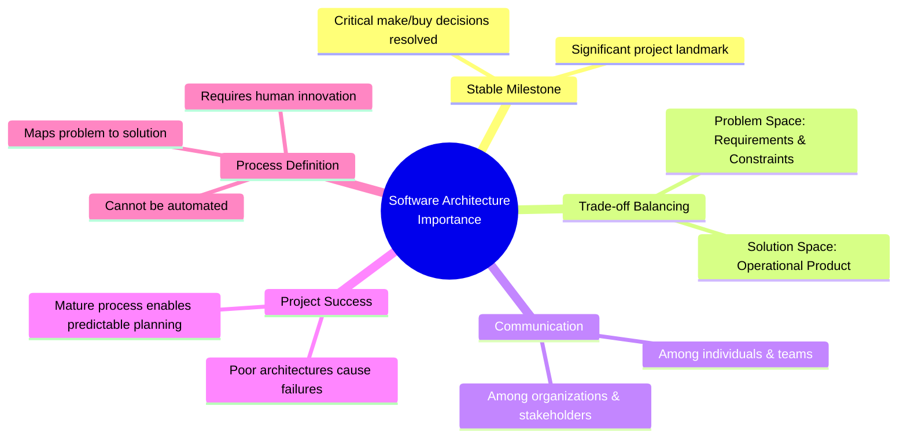

### Key Points Summary

- Achieving a **stable software architecture** represents a significant project milestone where critical make/buy decisions should have been resolved.
- Architecture representations provide a basis for **balancing trade-offs** between the problem space (requirements and constraints) and the solution space (the operational product).
- The architecture and process encapsulate many of the **important communications** among individuals, teams, organizations, and stakeholders.
- **Poor architectures** and immature processes are often cited as reasons for project failures.
- A mature process, understanding of primary requirements, and a demonstrable architecture are important **prerequisites for predictable planning**.
- Architecture development and process definition are **intellectual steps** that map the problem to a solution without violating constraints; they require human innovation and cannot be automated.

---

## Q2. What is a Workflow? Explain in Detail the Process Workflows.

### Definition of Workflow
A **Workflow** is a thread of cohesive and mostly sequential activities. Workflows are mapped to product artifacts and represent the major threads of work throughout the software development life cycle.

### Seven Top-Level Process Workflows

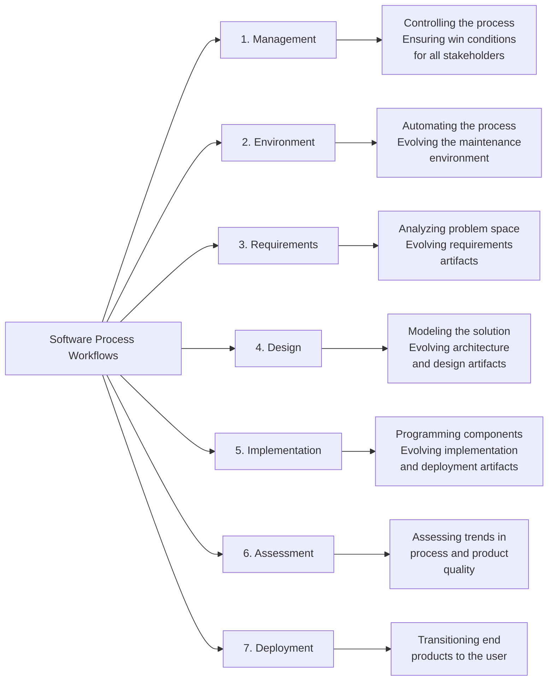

### Detailed Explanation of Each Workflow

| Workflow | Purpose | Key Activities |
|----------|---------|----------------|
| **Management** | Controlling the process | Ensuring win conditions for all stakeholders, planning, monitoring |
| **Environment** | Automating the process | Evolving the maintenance environment, tool support |
| **Requirements** | Analyzing problem space | Evolving the requirements artifacts, use case analysis |
| **Design** | Modeling the solution | Evolving the architecture and design artifacts |
| **Implementation** | Programming components | Evolving the implementation and deployment artifacts |
| **Assessment** | Quality assurance | Assessing trends in process and product quality |
| **Deployment** | Product transition | Transitioning end products to the user |

### Workflow Effort Distribution Across Life-Cycle Phases

```mermaid
gantt
    title Workflow Effort Distribution Across Phases
    dateFormat X
    axisFormat %s

    section Management
    Inception     :0, 25
    Elaboration   :25, 50
    Construction  :50, 85
    Transition    :85, 100

    section Requirements
    Inception     :0, 25
    Elaboration   :25, 50
    Construction  :50, 85
    Transition    :85, 100

    section Design
    Inception     :0, 25
    Elaboration   :25, 50
    Construction  :50, 85
    Transition    :85, 100

    section Implementation
    Inception     :0, 25
    Elaboration   :25, 50
    Construction  :50, 85
    Transition    :85, 100

    section Assessment
    Inception     :0, 25
    Elaboration   :25, 50
    Construction  :50, 85
    Transition    :85, 100

    section Deployment
    Inception     :0, 25
    Elaboration   :25, 50
    Construction  :50, 85
    Transition    :85, 100
```

The effort distribution varies across phases:
- **Inception & Elaboration**: Management, Requirements, and Design activities dominate
- **Construction**: Design, Implementation, and Assessment dominate
- **Transition**: Assessment and Deployment dominate

---

## Q3. State the Heuristics that Describe Objectively an Architecture Baseline.

### Architecture Baseline

An **architecture baseline** is a tangible set of artifacts that demonstrates the vision (function and quality) can be achieved within business case parameters.

### Architecture Views (Technical Perspective)

An architecture framework is defined in terms of **views** that are abstractions of UML models. Most real-world systems require **four views**:

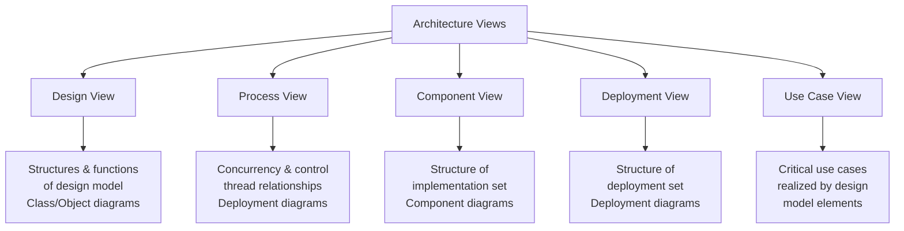

### Architecture Baseline Heuristics

An architecture baseline should include the following:

| Component | Baseline Content |
|-----------|-----------------|
| **Requirements** | Critical use cases, system-level quality objectives, priority relationships among features and qualities |
| **Design** | Names, attributes, structures, behaviors, groupings, and relationships of significant classes and components |
| **Implementation** | Source component inventory and bill of materials (number, name, purpose, cost) of all primitive components |
| **Deployment** | Executable components sufficient to demonstrate critical use cases and risk associated with achieving system qualities |

### Detailed View Descriptions

1. **Use Case View**: Describes how critical use cases are realized. Modeled statically using use case diagrams and dynamically using UML behavioral diagrams.

2. **Design View**: Addresses basic structure and functionality of the solution. Modeled using class and object diagrams.

3. **Process View**: Addresses run-time collaboration issues on a distributed deployment model — logical software network topology, interprocess communication, and state management.

4. **Component View**: Addresses software source code realization from integrators' and developers' perspectives — releases and configuration management.

5. **Deployment View**: Addresses executable realization — allocation of logical processes to physical resources of the deployment network.

---

## Q4. What is a Milestone? Explain Major and Minor Milestones with Respect to the Software Process.

### Definition of Milestone
A **milestone** is a well-defined checkpoint in the software development life cycle where joint management reviews are conducted to assess progress, synchronize perspectives, and verify that project aims have been achieved.

### Three Types of Checkpoints

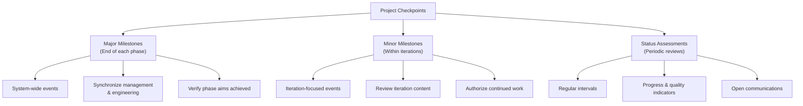

### Major Milestones

Major milestones occur at the **transition points between life-cycle phases**. There are four major milestones:

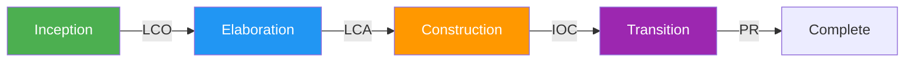

| Milestone | Phase End | Goal |
|-----------|-----------|------|
| **Life-Cycle Objectives (LCO)** | Inception | Present recommendation on how to proceed with development — plan, estimated cost/schedule, expected benefits. Authorization to proceed to elaboration. |
| **Life-Cycle Architecture (LCA)** | Elaboration | Demonstrate executable architecture to all stakeholders. Baseline architecture with human-readable representation and configuration-controlled software components. Authorization to proceed to construction. |
| **Initial Operational Capability (IOC)** | Construction | Assess readiness of software for transition into customer/user sites. Authorize the start of acceptance testing. |
| **Product Release (PR)** | Transition | Assess completion of software and transition to support organization. Review acceptance testing results and all open issues. |

### Minor Milestones

Minor milestones are needed for iterations with **one-month to six-month duration**:

| Minor Milestone | When | Purpose |
|-----------------|------|---------|
| **Iteration Readiness Review** | Start of each iteration | Review detailed iteration plan and evaluation criteria allocated to the iteration |
| **Iteration Assessment Review** | End of each iteration | Assess degree to which iteration objectives were achieved, review results, determine rework, assess impact on plan for subsequent iterations |

### Stakeholder Concerns at Milestones

- **Customers**: Schedule, budget, feasibility, risk assessment
- **Users**: Consistency with requirements, growth potential, quality
- **Architects**: Product line compatibility, trade-off analyses, completeness
- **Developers**: Requirements sufficiency, frameworks, risk resolution
- **Maintainers**: Documentation artifacts, understandability, interoperability

---

## Q5. Elaborate on the Iteration Planning Process with a Neat Diagram.

### Definition
The **Iteration Planning Process** is concerned with defining the actual sequence of intermediate results. An evolutionary build plan is important because there are always adjustments in build content and schedule as early conjecture evolves into well-understood project circumstances.

**Iteration** means a complete synchronization across the project, with a well-orchestrated global assessment of the entire project baseline.

### Iterations Across Life-Cycle Phases

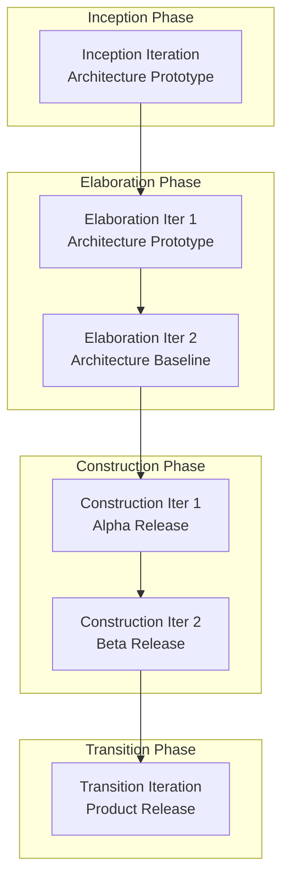

### Detailed Iteration Types

| Iteration Type | Description |
|----------------|-------------|
| **Inception iterations** | Early prototyping activities that integrate foundation components of a candidate architecture. Provides an executable framework for elaborating critical use cases. Includes existing, commercial, and custom prototype components. |
| **Elaboration iterations** | Result in complete architecture framework and infrastructure for execution. Critical use cases demonstrated: initializing architecture, worst-case data processing flow, worst-case control flow. |
| **Construction iterations** | Most projects require at least two: **Alpha release** and **Beta release**. |
| **Transition iterations** | Most projects use a single iteration to transition a beta release into the final product. |

### Typical Six-Iteration Profile

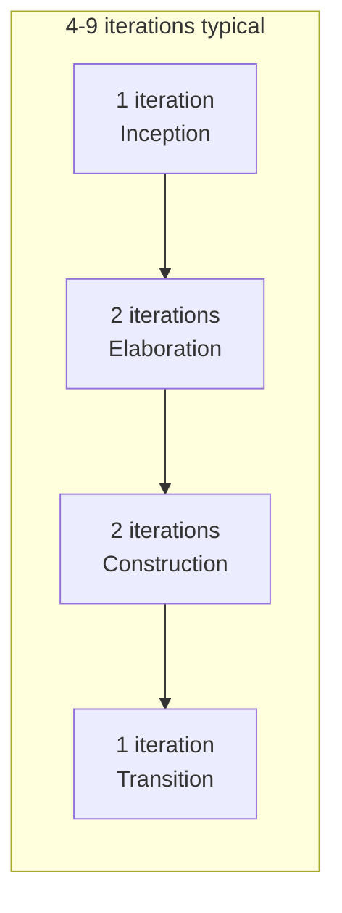

### Planning Balance Throughout the Life Cycle

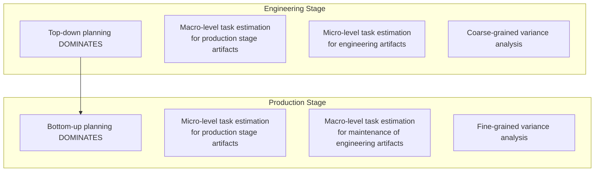

- **Top-down approach**: Forward-looking, starts with general requirements/constraints, derives macro-level budget and schedule
- **Bottom-up approach**: Backward-looking, starts with the end in mind, analyzes micro-level budgets and schedules
- During **Engineering Stage**: Top-down dominates (not enough stability for credible bottom-up planning)
- During **Production Stage**: Bottom-up dominates (enough precedent experience and planning fidelity)

---

## Q6. Define Iteration. Discuss the Sequence of Activities in an Iteration Workflow.

### Definition of Iteration
An **iteration** consists of a loosely sequential set of activities in various proportions, depending on where the iteration is located in the development cycle. Each iteration is defined in terms of a set of **allocated usage scenarios** and represents the state of the overall architecture and the complete deliverable system.

An **increment** represents the current progress that will be combined with the preceding iteration to form the next iteration.

### Sequence of Activities in an Iteration Workflow

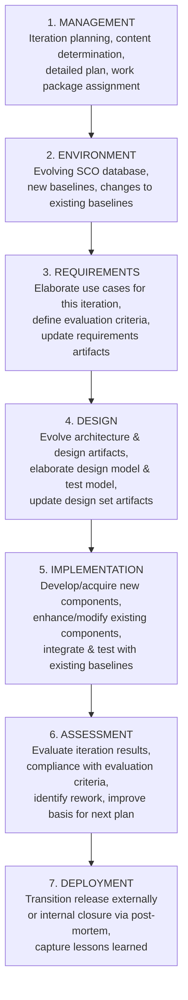

### Detailed Activity Descriptions

| Activity | Details |
|----------|---------|
| **Management** | Iteration planning to determine release content; develop detailed plan; assign work packages/tasks to team |
| **Environment** | Evolve SCO database to reflect new baselines and changes for all product, test, and environment components |
| **Requirements** | Analyze baseline plan, architecture, and requirements; fully elaborate use cases for this iteration with evaluation criteria; update artifacts as needed |
| **Design** | Evolve baseline architecture and design artifacts; elaborate design model and test model components for demonstration; update design artifacts |
| **Implementation** | Develop or acquire new components; enhance/modify existing components; integrate and test with existing baselines (previous versions) |
| **Assessment** | Evaluate compliance with evaluation criteria; assess quality of current baselines; identify rework and allocation to current or next release |
| **Deployment** | Transition release to external organization or internal closure; conduct post-mortem for lessons learned |

### Activity Emphasis Across Life-Cycle Phases

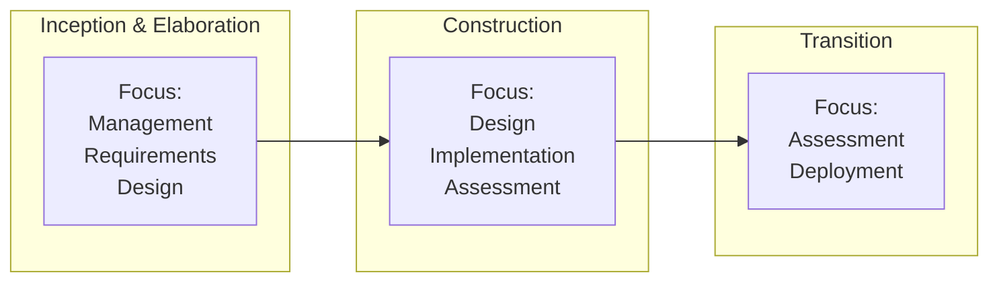

---

# UNIT IV

---

## Q1. Explain the Roles and Responsibilities of the Default Line-of-Business Organization.

### Overview
Organizations engaged in software development need to support projects with the infrastructure necessary to use a common process. The line-of-business organizations and project teams have different motivations:

- **Lines of business**: Motivated by ROI, new business discriminators, market diversification, and profitability
- **Project teams**: Motivated by cost, schedule, and quality of specific deliverables

### Default Line-of-Business Organization Structure

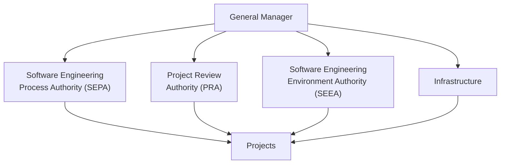

### Roles and Responsibilities

| Role | Responsibility |
|------|---------------|
| **SEPA (Software Engineering Process Authority)** | Facilitates exchange of information and process guidance to/from project practitioners. Accountable to General Manager for maintaining current assessment of organization's process maturity and plan for future improvement. |
| **PRA (Project Review Authority)** | Single individual responsible for ensuring software project complies with all organizational and business unit software policies, practices, and standards. Software Project Manager is responsible for meeting contract requirements. |
| **SEEA (Software Engineering Environment Authority)** | Responsible for automating the organization's process, maintaining standard environment, training projects to use the environment, and maintaining organization-wide reusable assets. Necessary to achieve significant ROI for common process. |
| **Infrastructure** | Provides human resources support, project-independent research and development, and other capital software engineering assets. |

### Key Features of Default Organization

1. Responsibility for **process definition & maintenance** is specific to a cohesive line of business
2. Responsibility for **process automation** is an organizational role equal in importance to process definition role
3. Organizational role may be fulfilled by a **single individual or several different teams**

---

## Q2. What is Automation? Explain the Building Blocks for Process Automation.

### Definition
**Process Automation** refers to the use of tools and environments to automate various activities in the software development process. The environment must be treated as a **first-class artifact** of the process.

### Key Principles
- Process automation and change management is **critical to an iterative process**
- If change is expensive, the development organization will **resist it**
- **Round-trip engineering** and integrated environments promote change freedom and effective evolution of technical artifacts
- **Metric automation** is crucial to effective project control

### Three Levels of Process Automation

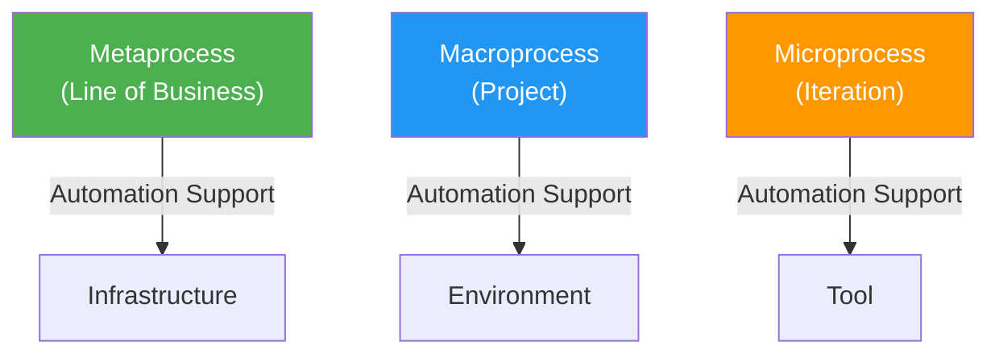

### Automation Building Blocks (Tools Mapped to Workflows)

| Workflow | Tools & Process Automation |
|----------|---------------------------|
| **Management** | Workflow automation, Metrics automation |
| **Environment** | Change Management, Document Automation |
| **Requirements** | Requirement Management |
| **Design** | Visual Modeling |
| **Implementation** | Editors, Compilers, Debuggers, Linkers, Runtime |
| **Assessment** | Test automation, Defect Tracking |
| **Deployment** | Defect Tracking |

### The Project Environment States

The project environment artifacts evolve through **three discrete states**:

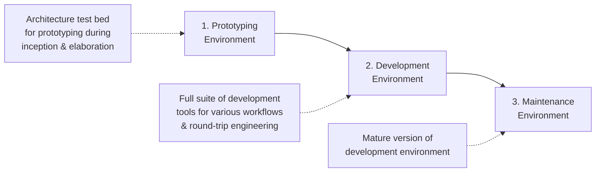

### Four Critical Environment Disciplines

1. **Round-Trip Engineering**: Tools integrated to maintain consistency and traceability across engineering artifacts
2. **Change Management**: Automated and enforced to manage multiple iterations and enable change freedom
3. **Infrastructure**: Organization policy and environment (standards, tools inventory)
4. **Stakeholder Environment**: On-line access for external stakeholders

---

## Q3. Illustrate the Software Project Team Evolution Over the Life Cycle.

### Overview
The software project organization evolves throughout the life cycle, with different teams taking different percentages of effort across the four phases.

### Team Evolution Across Phases

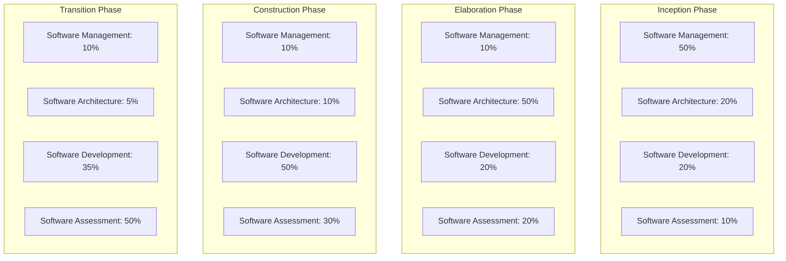

### Effort Distribution Table

| Team | Inception | Elaboration | Construction | Transition |
|------|-----------|-------------|--------------|------------|
| **Software Management** | 50% | 10% | 10% | 10% |
| **Software Architecture** | 20% | 50% | 10% | 5% |
| **Software Development** | 20% | 20% | 50% | 35% |
| **Software Assessment** | 10% | 20% | 30% | 50% |

### Key Observations

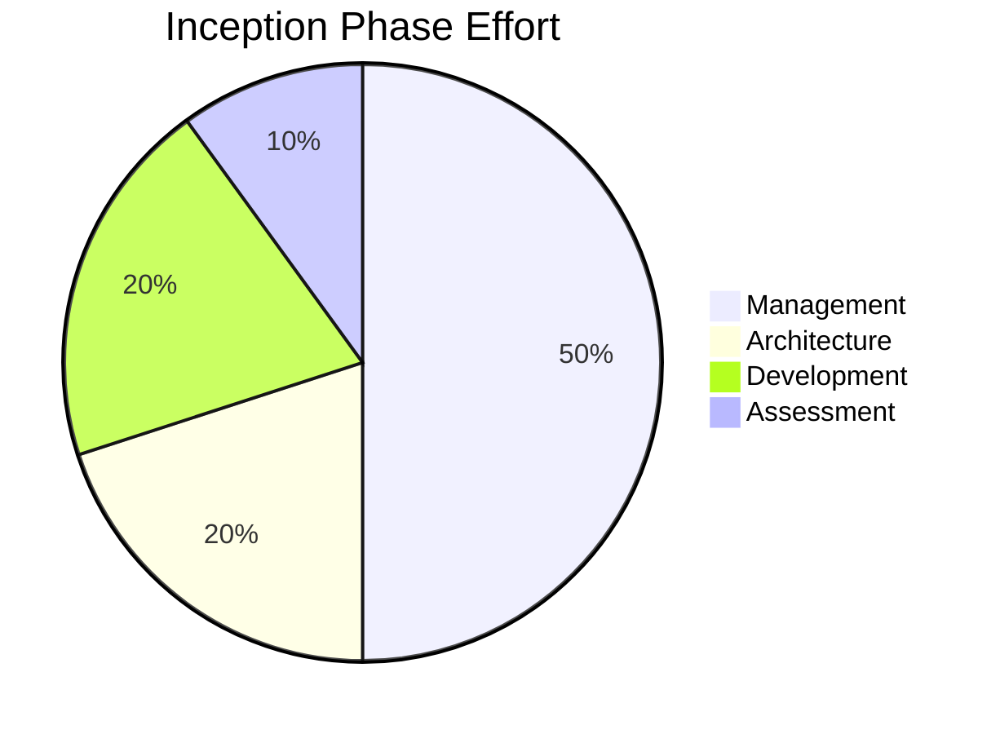

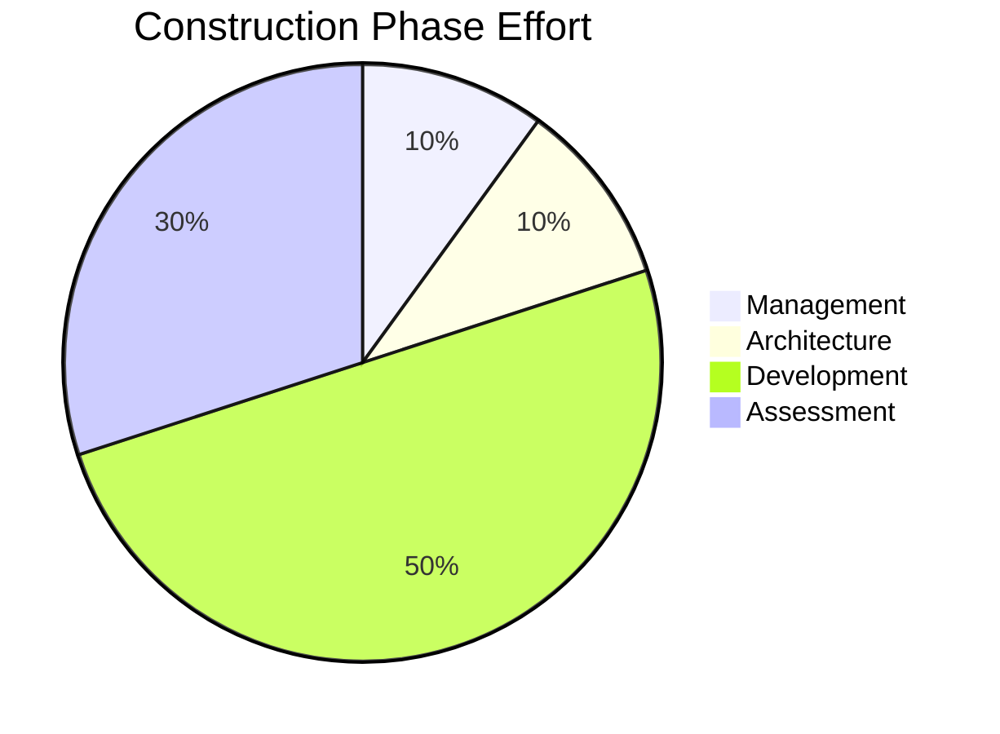

- **Inception**: Management dominates (50%) — business case development, planning
- **Elaboration**: Architecture dominates (50%) — building and demonstrating the architecture baseline
- **Construction**: Development dominates (50%) — component implementation, alpha/beta releases
- **Transition**: Assessment dominates (50%) — acceptance testing, quality assessment

---

## Q4. Explain About the Four Quality Indicators Used in the Software Process.

### Overview
Quality indicators are metrics used to assess and maintain software quality throughout the development process. The periodic status assessments use these indicators to track project health.

### Four Quality Indicators

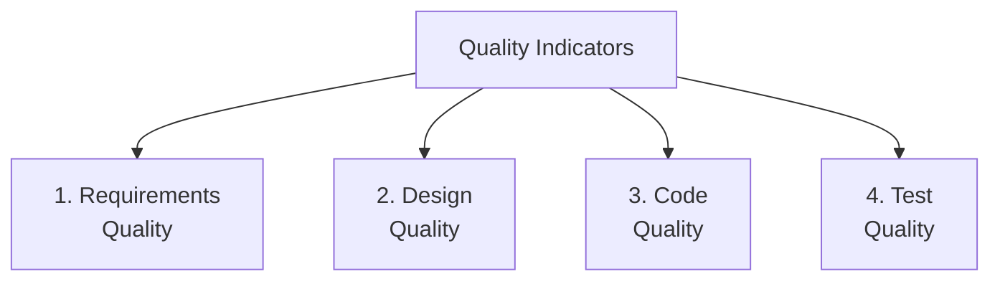

### Detailed Explanation

| Quality Indicator | Description | Metrics |
|-------------------|-------------|---------|
| **Requirements Quality** | Completeness, consistency, and traceability of requirements specifications | Requirements coverage, change rate of requirements, stakeholder satisfaction |
| **Design Quality** | Architectural soundness, modularity, and maintainability of the design | Component coupling/cohesion, design complexity, architecture stability |
| **Code Quality** | Reliability, efficiency, and maintainability of source code | Defect density, code complexity, compliance with standards |
| **Test Quality** | Adequacy and effectiveness of testing activities | Test coverage, defect detection rate, test case pass/fail ratio |

### Quality Assessment in Periodic Status Reviews

The default content of periodic status assessments includes:
- **A mechanism** for openly addressing, communicating, and resolving management issues, technical issues, and project risks
- **Objective data** derived directly from on-going activities and evolving product configurations
- **A mechanism** for disseminating process, progress, quality trends, practices, and experience information to all stakeholders

### Quality as an Organizational Responsibility

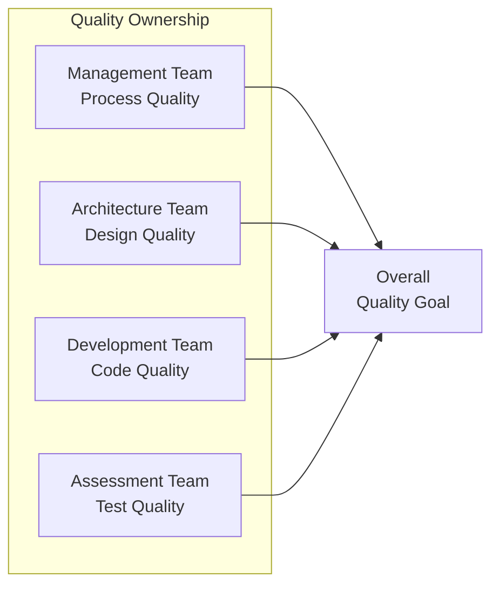

Quality is **everyone's responsibility**, integrated into all activities and checkpoints. Each team takes responsibility for a different quality perspective.

---

## Q5. Explain in Detail the Default Project Organization and Responsibilities.

### Default Project Organization Structure

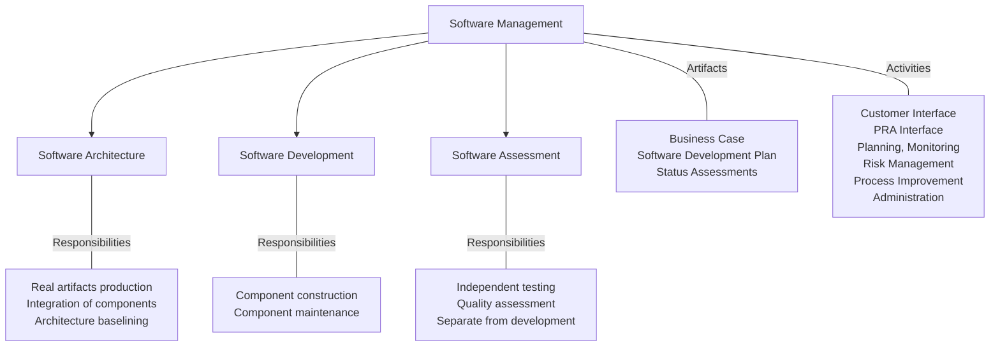

### Detailed Roles and Responsibilities

| Team | Artifacts | Key Activities |
|------|-----------|----------------|
| **Software Management** | Business case, Software development plan, Status assessments | Customer interface, PRA interface, Planning, Monitoring, Risk management, Software process definition, Process improvement, Administration |
| **Software Architecture** | Architecture artifacts, Integration plans | Responsible for real artifacts and for integration of components (not just staff functions) |
| **Software Development** | Component code, Unit tests | Owns component construction and maintenance activities |
| **Software Assessment** | Test plans, Test results, Quality reports | Separate from development, independent quality assessment |

### Key Features of Default Organization

1. **Management team** is an active participant — responsible for **producing as well as managing**
2. **Architecture team** is responsible for **real artifacts** and for integration of components — not just staff functions
3. **Development team** owns **component construction and maintenance** activities
4. **Assessment team** is **separate from development** — ensures independent quality evaluation
5. **Quality is everyone's responsibility** — integrated into all activities and checkpoints
6. Each team takes responsibility for a **different quality perspective**

---

## Q6. Give the Seven Core Metrics that are Used in Managing the Software Process.

### Overview
Seven core metrics are used to manage the software process effectively. These metrics provide objective data for tracking progress, assessing quality, and making informed decisions.

### The Seven Core Metrics

```mermaid
graph TD
    M["Seven Core Metrics"] --> M1["1. Work & Progress"]
    M --> M2["2. Budgeted Cost &<br/>Expenditures"]
    M --> M3["3. Staffing &<br/>Team Dynamics"]
    M --> M4["4. SLOC/Function<br/>Point Changes"]
    M --> M5["5. SCO Tracking<br/>& Change Traffic"]
    M --> M6["6. Open vs Closed<br/>SPRs/Defects"]
    M --> M7["7. Rework &<br/>Adaptability"]
```

### Detailed Description

| # | Metric | Description | Purpose |
|---|--------|-------------|---------|
| 1 | **Work & Progress** | Tracks work packages completed versus planned | Monitors schedule adherence and productivity |
| 2 | **Budgeted Cost & Expenditures** | Compares planned budget against actual expenditures | Financial control and cost management |
| 3 | **Staffing & Team Dynamics** | Tracks team size, allocation, and turnover | Resource planning and team health |
| 4 | **SLOC/Function Point Changes** | Measures size of the software in source lines of code or function points | Size estimation and productivity tracking |
| 5 | **SCO Tracking & Change Traffic** | Monitors Software Change Orders — volume and type of changes | Change management effectiveness |
| 6 | **Open vs Closed SPRs/Defects** | Tracks Software Problem Reports — open versus resolved | Quality trending and defect management |
| 7 | **Rework & Adaptability** | Measures amount of rework versus new work | Process efficiency and stability |

### Metrics in Context

- Metrics must be **automated** for effective project control
- They provide **objective data** derived from ongoing activities
- They support **variance analysis** (actual vs planned expenditures)
- During **Engineering Stage**: Coarse-grained variance analysis
- During **Production Stage**: Fine-grained variance analysis

---

## Q7. What is Round-Trip Engineering? Explain.

### Definition
**Round-Trip Engineering (RTE)** is the environment support necessary to maintain **consistency among the engineering artifacts**. It is the term used to describe the key requirement for environments that support iterative development.

### Concept

```mermaid
graph LR
    A["Requirements<br/>Model"] -->|"Forward<br/>Engineering"| B["Design<br/>Model"]
    B -->|"Forward<br/>Engineering"| C["Source<br/>Code"]
    C -->|"Reverse<br/>Engineering"| B
    B -->|"Reverse<br/>Engineering"| A
    C -->|"Forward<br/>Engineering"| D["Executable<br/>System"]
    D -->|"Feedback"| A

    style A fill:#4CAF50,color:white
    style B fill:#2196F3,color:white
    style C fill:#FF9800,color:white
    style D fill:#9C27B0,color:white
```

### Key Aspects of Round-Trip Engineering

1. **Tool Integration**: Tools must be integrated to maintain consistency and traceability across all engineering artifacts
2. **Bidirectional Synchronization**: Changes in one artifact (e.g., code) must be reflected in related artifacts (e.g., design model) and vice versa
3. **Automation Support**: As the software industry maintains different information sets for engineering artifacts, more automation support is needed to ensure efficient and error-free transition of data from one artifact to another

### Why RTE is Important

| Aspect | Without RTE | With RTE |
|--------|-------------|----------|
| **Consistency** | Manual synchronization, error-prone | Automated consistency maintenance |
| **Change Impact** | Difficult to trace | Immediate traceability |
| **Productivity** | Significant rework to maintain artifacts | Automatic propagation of changes |
| **Quality** | Inconsistencies between artifacts | Synchronized, consistent artifacts |

### RTE in the Context of Process Automation

```mermaid
graph TD
    subgraph "Round-Trip Engineering Environment"
        RM["Requirements<br/>Artifacts"] <-->|sync| DM["Design<br/>Artifacts"]
        DM <-->|sync| IM["Implementation<br/>Artifacts"]
        IM <-->|sync| TM["Test<br/>Artifacts"]
    end

    CM["Change Management<br/>(SCO Database)"] --> RM
    CM --> DM
    CM --> IM
    CM --> TM
```

- Round-trip engineering and integrated environments promote **change freedom** and effective evolution of technical artifacts
- If the change is expensive, the development organization will **resist it** — RTE reduces this cost
- RTE is one of the four critical environment disciplines alongside Change Management, Infrastructure, and Stakeholder Environment

---

# UNIT V

---

## Q1. What is Agile Methodology? Explain the Properties of Agile Methodology.

### Definition
**Agile methodology** is an iterative approach to software development where each iteration takes a short time interval of **1 to 4 weeks**. The agile development process is aligned to deliver the changing business requirements, distributing software with faster and fewer changes.

Unlike single-phase development (which takes 6 to 18 months), the agile process frequently takes feedback on workable products.

### Properties of Agile Methodology

```mermaid
mindmap
  root((Agile<br/>Methodology))
    Iterative Development
      1-4 week sprints
      Frequent feedback
      Workable product each iteration
    Roles
      Scrum Master
      Product Owner
      Cross-functional Team
    Key Practices
      Daily stand-ups
      Sprint planning
      Retrospectives
      Demos and reviews
    Principles
      Customer collaboration
      Responding to change
      Working software
      Individuals and interactions
```

### Roles in Agile

| Role | Responsibilities |
|------|-----------------|
| **Scrum Master** | Team leader and facility provider. Enables close cooperation, removes blocks, safeguards team from disturbances, tracks progress and processes. Ensures Agile inspect & adapt processes are leveraged correctly (planned meetings, daily stand-ups, demos, reviews, retrospectives). |
| **Product Owner** | Runs the product from business perspective. Defines and prioritizes requirements, sets release dates and contents, participates in iteration/release planning, ensures team works on most valued requirements, represents customer voice, accepts user stories meeting definition of done. |
| **Cross-functional Team** | Self-sufficient team of 5 to 9 members with 6-10 years average experience. Contains 3-4 developers, 1 tester, 1 technical lead, 1 scrum master, 1 product owner. Scrum Master and Product Owner are Team Interface; others are Technical Interface. |

### Agile Process Flow

```mermaid
graph LR
    A["Product<br/>Backlog"] --> B["Sprint<br/>Planning"]
    B --> C["Sprint<br/>(1-4 weeks)"]
    C --> D["Daily<br/>Stand-up"]
    D --> C
    C --> E["Sprint<br/>Review/Demo"]
    E --> F["Sprint<br/>Retrospective"]
    F --> B
    E --> G["Working<br/>Software<br/>Increment"]
```

### Key Properties

1. **Iterative**: Short 1-4 week cycles with deliverable output each iteration
2. **Adaptive**: Aligned to deliver changing business requirements
3. **Feedback-driven**: Frequent feedback on workable products
4. **Collaborative**: Close cooperation between all roles and functions
5. **Self-organizing**: Teams organize themselves around tasks and responsibilities
6. **Continuous improvement**: Regular retrospectives to improve processes
7. **Customer-focused**: Product Owner represents the voice of the customer

---

## Q2. What is DevOps? Explain the DevOps Delivery Pipelining.

### Definition
**DevOps** is a practice that combines software **Development (Dev)** and IT **Operations (Ops)** to shorten the development life cycle and provide continuous delivery with high software quality. It bridges the gap between deployment and operation terms.

DevOps architecture is used for applications hosted on cloud platforms and large distributed applications, using Agile Development for contiguous integration and delivery.

### DevOps Architecture Components

```mermaid
graph TD
    A["DevOps Architecture"] --> B["Plan"]
    A --> C["Code"]
    A --> D["Build"]
    A --> E["Test"]
    A --> F["Deploy"]
    A --> G["Operate"]
    A --> H["Monitor"]
    A --> I["Release"]
```

### DevOps Delivery Pipeline

The DevOps delivery pipeline is a set of **automated processes** that enables teams to efficiently build, test, and deploy software to production environments.

```mermaid
graph LR
    A["Source<br/>Control"] --> B["Build Automation<br/>/ CI"]
    B --> C["Test<br/>Automation"]
    C --> D["Deployment<br/>Automation"]
    D --> E["Containerization"]
    E --> F["Configuration<br/>Management"]
    F --> G["Monitoring"]
    G --> H["Feedback<br/>Loops"]
    H -->|"Continuous<br/>Improvement"| A

    style A fill:#4CAF50,color:white
    style B fill:#2196F3,color:white
    style C fill:#FF9800,color:white
    style D fill:#9C27B0,color:white
    style E fill:#E91E63,color:white
    style F fill:#00BCD4,color:white
    style G fill:#795548,color:white
    style H fill:#607D8B,color:white
```

### Pipeline Components in Detail

| Component | Description |
|-----------|-------------|
| **Source Control** | Management of code versions and changes, allowing collaboration and tracking of each change |
| **Build Automation / CI** | Automated compilation and building of code, ensuring integration with existing codebase |
| **Test Automation** | Running automated tests to validate functionality and performance |
| **Deployment Automation** | Automated deployment to various environments, from testing to production |
| **Containerization** | Packaging application and dependencies into containers for consistency across environments |
| **Configuration Management** | Managing and automating configuration of servers and infrastructure |
| **Monitoring** | Continuous monitoring of application and infrastructure for performance and availability |
| **Feedback Loops** | Gathering and incorporating feedback from various stages for improvement |

### CI/CD Flow

```mermaid
graph LR
    Dev["Developer<br/>Commits Code"] --> CI["Continuous<br/>Integration"]
    CI --> AT["Automated<br/>Testing"]
    AT -->|Pass| CD["Continuous<br/>Delivery"]
    AT -->|Fail| Dev
    CD --> Staging["Staging<br/>Environment"]
    Staging --> Prod["Production<br/>Deployment"]
    Prod --> Monitor["Continuous<br/>Monitoring"]
    Monitor -->|Feedback| Dev
```

---

## Q3. What is SCRUM Model? Focus on its Cycles.

### Definition
**SCRUM** is an agile framework for developing, delivering, and sustaining complex products. It uses an iterative and incremental approach to optimize predictability and manage risk.

### Scrum Cycle

```mermaid
graph TD
    PB["Product Backlog<br/>(Prioritized list of features)"] --> SP["Sprint Planning<br/>(Select items for sprint)"]
    SP --> SB["Sprint Backlog<br/>(Tasks for this sprint)"]
    SB --> Sprint["Sprint (1-4 weeks)"]

    Sprint --> DS["Daily Scrum<br/>(15-min stand-up)"]
    DS --> Sprint

    Sprint --> PI["Potentially Shippable<br/>Product Increment"]
    PI --> SR["Sprint Review<br/>(Demo to stakeholders)"]
    SR --> Retro["Sprint Retrospective<br/>(Process improvement)"]
    Retro --> SP

    style Sprint fill:#2196F3,color:white
    style PI fill:#4CAF50,color:white
```

### Scrum Roles

| Role | Responsibility |
|------|---------------|
| **Product Owner** | Defines requirements, prioritizes backlog, represents customer, accepts/rejects work |
| **Scrum Master** | Facilitates process, removes impediments, ensures team follows Scrum practices |
| **Development Team** | Self-organizing, cross-functional team (5-9 members) that delivers the increment |

### Scrum Ceremonies (Events)

| Event | Duration | Purpose |
|-------|----------|---------|
| **Sprint Planning** | Up to 8 hours | Select backlog items, define sprint goal, create sprint backlog |
| **Daily Scrum** | 15 minutes | Synchronize activities, identify impediments, plan next 24 hours |
| **Sprint Review** | Up to 4 hours | Demonstrate increment to stakeholders, gather feedback |
| **Sprint Retrospective** | Up to 3 hours | Reflect on process, identify improvements for next sprint |

### Scrum Artifacts

```mermaid
graph LR
    PB["Product Backlog<br/>- Ordered list of everything<br/>needed in the product<br/>- Managed by Product Owner"] --> SB["Sprint Backlog<br/>- Subset of Product Backlog<br/>- Tasks for current sprint<br/>- Owned by Dev Team"]
    SB --> INC["Increment<br/>- Sum of all completed<br/>backlog items<br/>- Must meet 'Definition of Done'"]
```

### Patterns for Adopting Scrum

1. **Start Small vs. Go All In**:
   - *Start Small*: Cost-effective, reduces risk, allows early success with first scrum project; early adapters become coaches
   - *Go All In*: When executives are convinced; reduces resistance within different teams

2. **Public Display of Agility vs. Stealth Mode**:
   - *Public Display*: Announce adoption publicly; sends powerful message, solicits organizational support
   - *Stealth Transition*: Only team knows; gives chance to make progress before resistance starts

---

## Q4. Explain the Tools that Support Implementation of DevOps.

### DevOps Tool Stack

```mermaid
graph TD
    TS["DevOps Tool Stack"] --> VCS["Version Control<br/>Systems"]
    TS --> CICD["CI/CD Tools"]
    TS --> CM["Configuration<br/>Management"]
    TS --> CONT["Containerization &<br/>Orchestration"]
    TS --> MON["Monitoring &<br/>Logging"]

    VCS --> V1["Git"]
    VCS --> V2["GitHub / GitLab"]
    VCS --> V3["Bitbucket"]
    VCS --> V4["AWS CodeCommit"]

    CICD --> C1["Jenkins"]
    CICD --> C2["Travis CI"]
    CICD --> C3["GitLab CI"]
    CICD --> C4["TeamCity"]

    CM --> CM1["Ansible"]
    CM --> CM2["Puppet"]
    CM --> CM3["Chef"]

    CONT --> CO1["Docker"]
    CONT --> CO2["Kubernetes"]

    MON --> M1["Nagios"]
    MON --> M2["Splunk"]
    MON --> M3["ELK Stack"]
```

### Tool Categories and Details

| Category | Tools | Purpose |
|----------|-------|---------|
| **DVCS (Distributed Version Control)** | Git, GitHub, GitLab, Bitbucket, AWS CodeCommit | Manage code changes, enable collaboration, track modifications |
| **CI/CD Tools** | Jenkins, TeamCity, Bamboo, Shippable, Concourse CI | Automate integration, testing, and deployment of code |
| **Container & Orchestration** | Docker, Kubernetes | Create and manage containers, make applications portable and scalable |
| **Configuration Management** | Ansible, Puppet, Chef | Automate server configuration, ensure consistency across environments |
| **JSON & NoSQL Servers** | MongoDB, CouchDB | Flexible, scalable data storage and retrieval |
| **Monitoring & Logging** | Nagios, Splunk, ELK Stack | Track application performance and system health |
| **Collaboration & Planning** | Jira, Trello | Agile planning and team collaboration |
| **IaC (Infrastructure as Code)** | Terraform, AWS CloudFormation | Manage infrastructure through code |
| **Security (DevSecOps)** | SonarQube, Aqua Security | Integrate security into DevOps pipeline |

### Tool Integration in Pipeline

```mermaid
graph LR
    A["Git<br/>(Source Control)"] --> B["Jenkins<br/>(CI/CD)"]
    B --> C["Docker<br/>(Containerization)"]
    C --> D["Kubernetes<br/>(Orchestration)"]
    D --> E["Ansible<br/>(Config Mgmt)"]
    E --> F["Nagios/Splunk<br/>(Monitoring)"]
    F -->|"Feedback"| A
```

---

## Q5. Give the Significance of Various Components of DevOps Ecosystem.

### DevOps Ecosystem Overview

The DevOps ecosystem encompasses a wide range of tools and practices designed to facilitate **collaboration, integration, and automation** across the entire SDLC.

```mermaid
graph TD
    ECO["DevOps Ecosystem"] --> VCS["1. Version Control<br/>Systems (VCS)"]
    ECO --> CICD["2. CI/CD"]
    ECO --> CM["3. Configuration<br/>Management"]
    ECO --> CON["4. Containerization"]
    ECO --> ML["5. Monitoring &<br/>Logging"]
    ECO --> CP["6. Collaboration &<br/>Planning"]
    ECO --> IAC["7. Infrastructure<br/>as Code"]
    ECO --> SEC["8. Security<br/>(DevSecOps)"]
```

### Significance of Each Component

| Component | Significance | Key Tools |
|-----------|-------------|-----------|
| **Version Control Systems** | Manage source code changes, enable team collaboration, maintain history of all modifications | Git, Subversion |
| **CI/CD** | Automate building, testing, and deployment; ensure rapid and reliable software releases | Jenkins, Travis CI, GitLab CI |
| **Configuration Management** | Automate server configuration; ensure consistent environments; reduce manual errors | Ansible, Puppet, Chef |
| **Containerization** | Package applications with dependencies; ensure consistent deployment across environments; enable scalability | Docker, Kubernetes |
| **Monitoring & Logging** | Provide insights into application performance and system health; enable proactive issue detection | Nagios, Splunk, ELK Stack |
| **Collaboration & Planning** | Facilitate agile planning; improve team communication and coordination | Jira, Trello |
| **Infrastructure as Code** | Manage infrastructure programmatically; enable version-controlled, reproducible environments | Terraform, CloudFormation |
| **Security (DevSecOps)** | Integrate security practices into DevOps pipeline; ensure code quality and vulnerability detection | SonarQube, Aqua Security |

### Ecosystem Integration

```mermaid
graph LR
    subgraph "Development"
        VCS["Version Control"]
        IDE["Development Tools"]
    end

    subgraph "Integration"
        CI["Continuous Integration"]
        TEST["Automated Testing"]
    end

    subgraph "Delivery"
        CD["Continuous Delivery"]
        CONT["Containerization"]
    end

    subgraph "Operations"
        ORCH["Orchestration"]
        MON["Monitoring"]
        CONFIG["Configuration Mgmt"]
    end

    VCS --> CI --> CD --> ORCH
    IDE --> CI
    CI --> TEST
    CD --> CONT
    ORCH --> MON
    MON -->|"Feedback"| VCS
    CONFIG --> ORCH
```

The DevOps ecosystem is **constantly evolving**, with new tools and practices emerging to address challenges of modern software development. Organizations must choose the right set of tools that align with their goals and workflows.

---

## Q6. Mention Some of the Core Benefits of DevOps.

### Core Benefits of DevOps

```mermaid
mindmap
  root((DevOps<br/>Benefits))
    Speed
      Faster Time to Market
      Accelerated delivery
      Reduced deployment time
    Quality
      Improved Software Quality
      CI/CD ensures frequent testing
      Reduced bugs by 35%
    Collaboration
      Enhanced Team Collaboration
      Breaking down silos
      Shared responsibility
    Efficiency
      Increased Efficiency
      Automation of tasks
      Better resource utilization
    Customer
      Higher Customer Satisfaction
      Faster response to needs
      Fewer errors in releases
    Risk
      Reduced Risk
      Smaller incremental deployments
      Easier rollback
    Culture
      Continuous Improvement
      Feedback loops
      Learning culture
```

### Detailed Benefits

| # | Benefit | Description |
|---|---------|-------------|
| 1 | **Faster Time to Market** | DevOps practices enable accelerated delivery of features and updates, reducing time from development to deployment |
| 2 | **Enhanced Collaboration** | Fosters a culture of collaboration between development and operations teams, breaking down silos and improving communication |
| 3 | **Increased Efficiency** | Automation of repetitive tasks in the SDLC leads to increased efficiency and frees up time for innovation |
| 4 | **Improved Quality** | CI/CD practices ensure code is tested frequently, leading to higher quality software |
| 5 | **Better Resource Management** | Infrastructure managed and scaled programmatically for better utilization |
| 6 | **Higher Customer Satisfaction** | Delivering updates more frequently with fewer errors; responding to customer needs effectively |
| 7 | **Reduced Risk** | Frequent deployments with smaller changes reduce risk associated with large-scale releases |
| 8 | **Continuous Improvement** | Encourages continuous learning and improvement with feedback loops informing future development |

### Real-World Impact

| Instance | Impact |
|----------|--------|
| **Online Financial Trading Company** | Reduced deployment time to 45 seconds (from entire nights/weekends) |
| **Network Cycling (Telecom)** | Accelerated deployment, testing, and design by 10x; daily security patching instead of quarterly |
| **Car Manufacturing** | Identified errors during production scaling that weren't caught before |
| **United Airlines** | Saved $500,000; increased code coverage by 85% |
| **GM Financial** | Reduced regression testing time by 93%; reduced loan funding period by 5x |
| **Rabobank** | Reduced bugs by 35%; pre-production bugs by 40% |

---

## Q7. Explain the Difference Between the Traditional Waterfall Model and the Agile Model.

### Comparison Overview

```mermaid
graph TB
    subgraph "Waterfall Model (Sequential)"
        W1["Requirements"] --> W2["Design"]
        W2 --> W3["Implementation"]
        W3 --> W4["Testing"]
        W4 --> W5["Deployment"]
        W5 --> W6["Maintenance"]
    end

    subgraph "Agile Model (Iterative)"
        A1["Sprint 1"] --> A2["Sprint 2"]
        A2 --> A3["Sprint 3"]
        A3 --> A4["Sprint N"]
        A4 --> A5["Release"]

        A1 -.->|"Plan→Code→Test→Review"| A1
        A2 -.->|"Plan→Code→Test→Review"| A2
        A3 -.->|"Plan→Code→Test→Review"| A3
    end
```

### Detailed Comparison Table

| Parameter | Waterfall Model | Agile Model |
|-----------|----------------|-------------|
| **Approach** | Linear and sequential | Iterative and incremental |
| **Development Cycle** | Single phase: 6-18 months | Short iterations: 1-4 weeks |
| **Requirements** | All gathered at the beginning; fixed | Evolve throughout the project; flexible |
| **Customer Involvement** | Limited to beginning and end | Continuous throughout the project |
| **Feedback** | At the end of the project | After each iteration |
| **Risk Management** | All risks predicted initially | Risks managed iteratively |
| **Flexibility** | Rigid; difficult to accommodate changes | Highly flexible; change is welcomed |
| **Testing** | After implementation phase | Continuous testing within each sprint |
| **Delivery** | Single delivery at the end | Incremental delivery after each sprint |
| **Documentation** | Extensive documentation required | Working software over comprehensive documentation |
| **Team Structure** | Specialized teams for each phase | Cross-functional, self-organizing teams |
| **Planning** | Detailed upfront planning | Adaptive planning with each iteration |
| **Suitability** | Well-defined, stable requirements | Dynamic, evolving requirements |
| **Cost of Change** | Very high (late in project) | Low (changes incorporated early) |
| **User Satisfaction** | Product may not meet evolved needs | Higher; continuous feedback ensures alignment |

### Process Flow Comparison

```mermaid
graph LR
    subgraph "Waterfall"
        direction LR
        WR["Requirements<br/>100%"] --> WD["Design<br/>100%"]
        WD --> WI["Implementation<br/>100%"]
        WI --> WT["Testing<br/>100%"]
        WT --> WDP["Deploy"]
    end

    subgraph "Agile"
        direction LR
        S1["Sprint 1<br/>R+D+I+T"] --> S2["Sprint 2<br/>R+D+I+T"]
        S2 --> S3["Sprint 3<br/>R+D+I+T"]
        S3 --> SN["Sprint N<br/>R+D+I+T"]
    end
```

### Key Differences in Philosophy

```mermaid
graph TD
    subgraph "Waterfall Philosophy"
        WP1["Plan Everything Upfront"]
        WP2["Follow the Plan"]
        WP3["Comprehensive Documentation"]
        WP4["Contract Negotiation"]
    end

    subgraph "Agile Philosophy"
        AP1["Plan Iteratively"]
        AP2["Respond to Change"]
        AP3["Working Software"]
        AP4["Customer Collaboration"]
    end
```

### When to Use Each

| Waterfall | Agile |
|-----------|-------|
| Requirements are well-defined and stable | Requirements are expected to change |
| Project has fixed scope and timeline | Project needs flexibility |
| Technology is well-understood | Innovation and exploration needed |
| Low customer interaction needed | High customer involvement required |
| Regulatory or compliance requirements | Fast time-to-market priority |

---

*End of SPM Mid 2 Question Bank Answers*
