# Microprocessors & Embedded Systems — Mid-2 Comprehensive Answers

---

# UNIT-3: 8086 Interfacing

---

## Q1(A): Design an interface between 8086 CPU and two chips of 16K×8 EPROM and two chips of 32K×8 SRAM. RAM address starts at 00000H. (5 Marks)

### Memory Requirements

| Chip | Type | Size | Address Lines | Count |
|------|------|------|---------------|-------|
| SRAM | 32K × 8 | 32KB each | A0–A14 | 2 |
| EPROM | 16K × 8 | 16KB each | A0–A13 | 2 |

- **Total RAM** = 2 × 32KB = 64KB (00000H – 0FFFFH)
- **Total EPROM** = 2 × 16KB = 32KB (Starting after RAM: 10000H – 17FFFH)

### Address Map

| Chip | Address Range | Size |
|------|--------------|------|
| SRAM-1 | 00000H – 07FFFH | 32KB |
| SRAM-2 | 08000H – 0FFFFH | 32KB |
| EPROM-1 | 10000H – 13FFFH | 16KB |
| EPROM-2 | 14000H – 17FFFH | 16KB |

### Chip Select Logic

- **SRAM-1**: A19–A15 = 00000 → CS̄ active when A15=0, A16–A19=0
- **SRAM-2**: A19–A16 = 0000, A15 = 1 → CS̄ active
- **EPROM-1**: A19–A17 = 000, A16=1, A14=0
- **EPROM-2**: A19–A17 = 000, A16=1, A14=1

### Interface Block Diagram

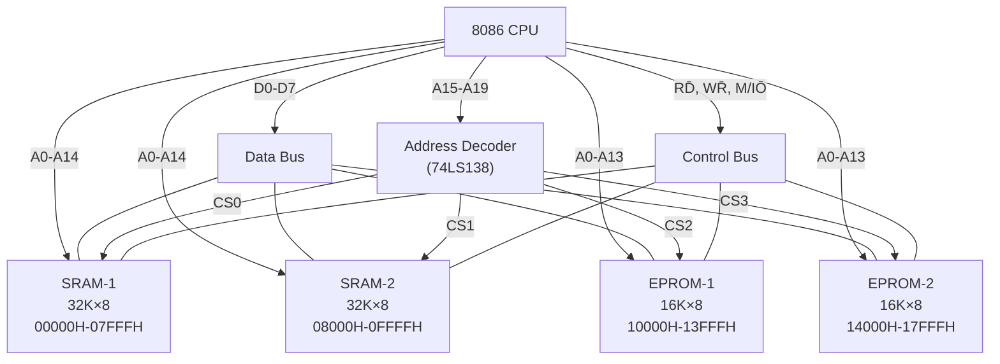

### Key Design Points
- **8282 Latch** is used to demultiplex AD0–AD7 (address/data bus)
- **74LS138 decoder** generates chip select signals from higher address lines
- SRAM connects to both RD̄ and WR̄; EPROM connects only to RD̄ (read-only)
- M/IŌ = 1 ensures memory space is selected

---

## Q1(B): Explain the Architecture of 8255. (5 Marks)

### Introduction
The **8255 Programmable Peripheral Interface (PPI)** is a general-purpose I/O device designed to interface peripherals to the 8086 microprocessor. It has **24 I/O pins** organized into 3 ports.

### Architecture Block Diagram

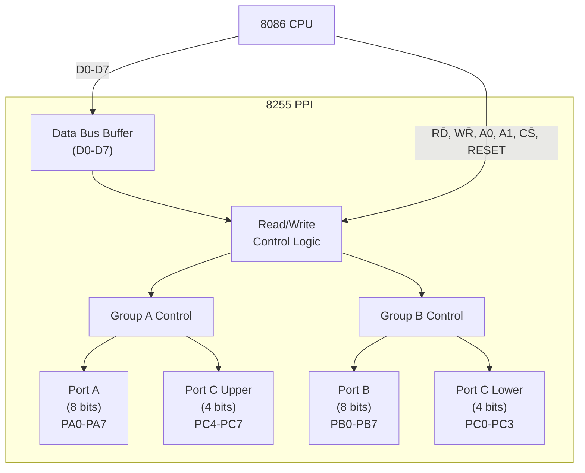

### Pin Description

| Pin | Function |
|-----|----------|
| D0–D7 | Bidirectional data bus |
| A0, A1 | Port select (00=A, 01=B, 10=C, 11=CWR) |
| CS̄ | Chip Select (active low) |
| RD̄ | Read strobe |
| WR̄ | Write strobe |
| RESET | Resets all ports to input mode |
| PA0–PA7 | Port A (8 bits) |
| PB0–PB7 | Port B (8 bits) |
| PC0–PC7 | Port C (8 bits, split upper/lower) |

### Functional Blocks

1. **Data Bus Buffer**: Tristate 8-bit bidirectional buffer interfacing internal bus to system data bus
2. **Read/Write Control Logic**: Accepts control signals (RD̄, WR̄, A0, A1, CS̄) and manages internal data transfers
3. **Group A Control**: Controls Port A and Port C upper (PC4–PC7)
4. **Group B Control**: Controls Port B and Port C lower (PC0–PC3)
5. **Port A**: 8-bit I/O port, supports all 3 modes (Mode 0, 1, 2)
6. **Port B**: 8-bit I/O port, supports Mode 0 and Mode 1
7. **Port C**: 8-bit port split into two 4-bit halves, used for I/O or handshake signals

### Operating Modes
- **Mode 0**: Basic I/O (no handshaking)
- **Mode 1**: Strobed I/O (with handshaking)
- **Mode 2**: Bidirectional bus (Port A only)

---

## Q2(A): Assembly Language Program for Interfacing Seven-Segment Display with 8086. (5 Marks)

### Seven-Segment Display Basics

A seven-segment display consists of 7 LEDs (a–g) + decimal point, used to display digits 0–9 and some characters.

```
    ___
   | a |
 f |___| b
   | g |
 e |___| c
   | d |  .dp
```

### Segment Encoding (Common Cathode)

| Digit | g | f | e | d | c | b | a | Hex Code |
|-------|---|---|---|---|---|---|---|----------|
| 0 | 0 | 1 | 1 | 1 | 1 | 1 | 1 | 3FH |
| 1 | 0 | 0 | 0 | 0 | 1 | 1 | 0 | 06H |
| 2 | 1 | 0 | 1 | 1 | 0 | 1 | 1 | 5BH |
| 3 | 1 | 0 | 0 | 1 | 1 | 1 | 1 | 4FH |
| 4 | 1 | 1 | 0 | 0 | 1 | 1 | 0 | 66H |
| 5 | 1 | 1 | 0 | 1 | 1 | 0 | 1 | 6DH |
| 6 | 1 | 1 | 1 | 1 | 1 | 0 | 1 | 7DH |
| 7 | 0 | 0 | 0 | 0 | 1 | 1 | 1 | 07H |
| 8 | 1 | 1 | 1 | 1 | 1 | 1 | 1 | 7FH |
| 9 | 1 | 1 | 0 | 1 | 1 | 1 | 1 | 6FH |

### Interface Diagram

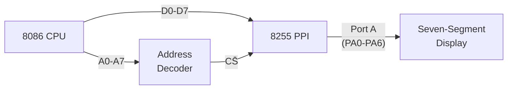

### Assembly Language Program

```asm
; 8255 Port Addresses
CWR     EQU 0303H       ; Control Word Register address
PORTA   EQU 0300H       ; Port A address

; Look-up table for 7-segment codes (0-9)
TABLE   DB 3FH, 06H, 5BH, 4FH, 66H, 6DH, 7DH, 07H, 7FH, 6FH

; Program to display digits 0-9 continuously
        MOV AL, 80H      ; CWR: All ports output, Mode 0
        MOV DX, CWR
        OUT DX, AL        ; Configure 8255

START:  LEA SI, TABLE     ; Point SI to look-up table
        MOV CX, 0AH      ; Count = 10 digits

NEXT:   MOV AL, [SI]      ; Get segment code
        MOV DX, PORTA
        OUT DX, AL        ; Send to Port A → Display
        CALL DELAY        ; Wait for visibility
        INC SI            ; Next digit
        LOOP NEXT         ; Repeat for all 10 digits
        JMP START         ; Loop forever

DELAY:  MOV BX, 0FFFFH   ; Delay subroutine
D1:     DEC BX
        JNZ D1
        RET
```

### Working
1. **8255 is configured** with CWR = 80H (all ports as output, Mode 0)
2. Look-up table stores the 7-segment hex codes for digits 0–9
3. Each code is sent to **Port A**, which drives the display segments
4. A software delay ensures each digit is visible before the next one appears

---

## Q2(B): Illustrate the Operation of the 8251 USART with Architecture. (5 Marks)

### Introduction
The **Intel 8251 USART** (Universal Synchronous/Asynchronous Receiver/Transmitter) is a programmable serial communication interface chip used to convert parallel data to serial (and vice versa) for communication with peripherals.

### Architecture Block Diagram

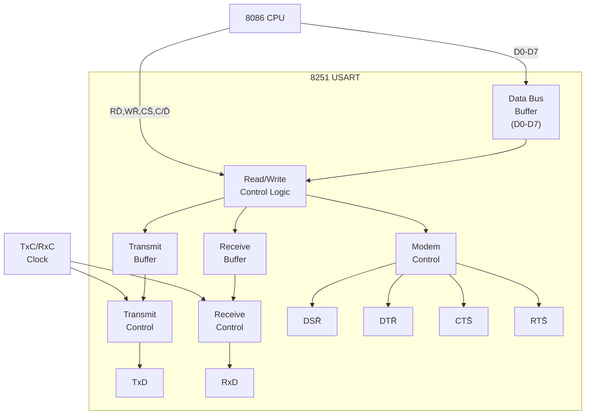

### Key Functional Blocks

1. **Data Bus Buffer**: 8-bit bidirectional buffer connecting to CPU data bus
2. **Read/Write Control Logic**: Decodes CS̄, C/D̄, RD̄, WR̄ to select data/control/status registers
3. **Transmit Buffer & Control**: Accepts parallel data from CPU, adds start/stop/parity bits, shifts out serially via TxD
4. **Receive Buffer & Control**: Receives serial data on RxD, strips framing bits, presents parallel data to CPU
5. **Modem Control**: Handles hardware flow control signals (DTR̄, DSR̄, RTS̄, CTS̄)

### Operating Modes

| Mode | Description |
|------|-------------|
| **Asynchronous** | Uses start/stop bits; baud rate = 1×, 16×, or 64× clock |
| **Synchronous** | Uses SYNC characters for framing; no start/stop bits |

### Programming Sequence
1. Write **Mode Word** (defines sync/async, baud rate, parity, stop bits)
2. Write **Command Word** (enable TX/RX, error reset, RTS/DTR control)
3. Read **Status Word** (check TxRDY, RxRDY, errors)

### Status Register Flags

| Bit | Flag | Meaning |
|-----|------|---------|
| D0 | TxRDY | Transmitter ready for data |
| D1 | RxRDY | Received data ready |
| D2 | TxE | Transmit buffer empty |
| D3 | PE | Parity error |
| D4 | OE | Overrun error |
| D5 | FE | Framing error |
| D6 | SYNDET | Sync character detected |
| D7 | DSR | Data Set Ready status |

---

## Q4(A): Explain the CWR Format for BSR and I/O Mode of the 8255 PPI. (5 Marks)

### Control Word Register (CWR)

The CWR is an 8-bit register at address A1A0 = 11. Its format changes based on **Bit D7**:

### 1. I/O Mode Control Word (D7 = 1)

```
  D7   D6   D5   D4   D3   D2   D1   D0
┌────┬────┬────┬────┬────┬────┬────┬────┐
│ 1  │ GA  │ GA  │ GA  │ GA  │ GB  │ GB  │ GB  │
│Mode│Mode│PortA│PC-U │PC-L │Mode│PortB│PC-L │
│Flag│Sel │I/O  │I/O  │I/O  │Sel │I/O  │I/O  │
└────┴────┴────┴────┴────┴────┴────┴────┘
```

| Bit | Function | Values |
|-----|----------|--------|
| D7 | Mode Set Flag | 1 = Active |
| D6–D5 | Group A Mode | 00=Mode 0, 01=Mode 1, 1X=Mode 2 |
| D4 | Port A Direction | 0=Output, 1=Input |
| D3 | Port C Upper (PC4–PC7) | 0=Output, 1=Input |
| D2 | Group B Mode | 0=Mode 0, 1=Mode 1 |
| D1 | Port B Direction | 0=Output, 1=Input |
| D0 | Port C Lower (PC0–PC3) | 0=Output, 1=Input |

**Example**: CWR = **80H** (10000000B) → All ports output, Mode 0
**Example**: CWR = **82H** (10000010B) → Port B input, rest output, Mode 0

### 2. BSR (Bit Set/Reset) Mode Control Word (D7 = 0)

```
  D7   D6   D5   D4   D3   D2   D1   D0
┌────┬────┬────┬────┬────┬────┬────┬────┐
│ 0  │ X  │ X  │ X  │ Bit│ Bit│ Bit│ S/R│
│BSR │Don't│Don't│Don't│Select│Select│Select│Set/ │
│Flag│Care│Care│Care│ B2 │ B1 │ B0 │Reset│
└────┴────┴────┴────┴────┴────┴────┴────┘
```

| Bit | Function |
|-----|----------|
| D7 | 0 = BSR mode |
| D6–D4 | Don't care (X) |
| D3–D1 | Bit select (000=PC0 ... 111=PC7) |
| D0 | 0=Reset (clear), 1=Set |

**Example**: To **Set PC5** → CWR = 0000 1011 = **0BH**
- D3D2D1 = 101 (selects bit 5), D0 = 1 (set)

**Example**: To **Reset PC2** → CWR = 0000 0100 = **04H**
- D3D2D1 = 010 (selects bit 2), D0 = 0 (reset)

---

## Q4(B): Assembly Language Program to Interface a Stepper Motor with 8086. (5 Marks)

### Stepper Motor Basics
A stepper motor rotates in discrete steps. A **4-phase unipolar stepper motor** requires a specific sequence of excitation to its coils.

### Excitation Sequences

**Full-Step Sequence (One-phase-on):**

| Step | Coil A | Coil B | Coil C | Coil D | Hex |
|------|--------|--------|--------|--------|-----|
| 1 | 1 | 0 | 0 | 0 | 01H |
| 2 | 0 | 1 | 0 | 0 | 02H |
| 3 | 0 | 0 | 1 | 0 | 04H |
| 4 | 0 | 0 | 0 | 1 | 08H |

### Interface Diagram

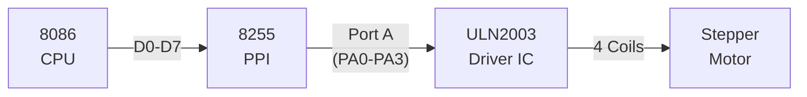

- **ULN2003** is a Darlington transistor array used as a current driver (8255 cannot source enough current for motor coils)

### Assembly Language Program

```asm
; Stepper Motor Rotation - Clockwise
CWR     EQU 0303H
PORTA   EQU 0300H

; Step sequence table for clockwise rotation
SEQ     DB 01H, 02H, 04H, 08H

        MOV AL, 80H        ; All ports output, Mode 0
        MOV DX, CWR
        OUT DX, AL          ; Configure 8255

ROTATE: LEA SI, SEQ         ; Point to step sequence
        MOV CX, 04H         ; 4 steps per cycle

STEP:   MOV AL, [SI]        ; Get step data
        MOV DX, PORTA
        OUT DX, AL          ; Send to motor coils via Port A
        CALL DELAY          ; Wait between steps
        INC SI              ; Next step
        LOOP STEP           ; Repeat 4 steps
        JMP ROTATE          ; Continuous rotation

; For Anti-clockwise: reverse sequence → 08H, 04H, 02H, 01H

DELAY:  MOV BX, 0FFFFH
D1:     MOV DI, 00FFH
D2:     DEC DI
        JNZ D2
        DEC BX
        JNZ D1
        RET
```

### Key Points
- **Clockwise**: Sequence 01→02→04→08 (forward)
- **Anti-clockwise**: Sequence 08→04→02→01 (reverse)
- **Speed control**: Adjust DELAY subroutine timing
- **Step angle**: Depends on motor (commonly 1.8° or 7.5° per step)
- The **ULN2003** driver amplifies the 8255 output signals to drive motor coils

---
---

# UNIT-4: 8051 Intel 8051 Microcontroller and Interfacing

---

## Q1(A): Draw the 8051 Microcontroller Architecture and Explain its Operation. (5 Marks)

### Introduction
The **Intel 8051** is an 8-bit microcontroller with on-chip RAM, ROM, timers, serial port, and I/O ports. It is widely used in embedded systems.

### Architecture Block Diagram

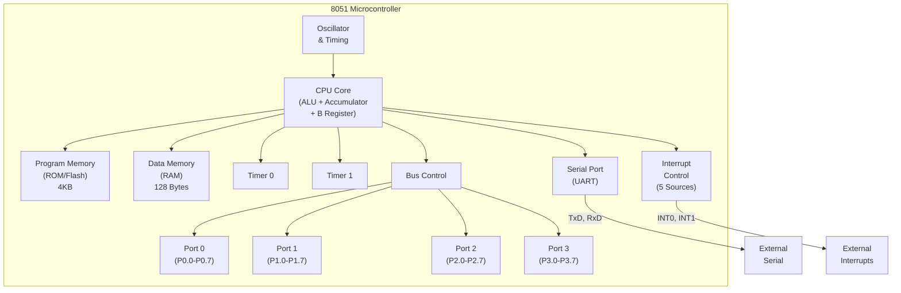

### Key Functional Blocks

| Block | Description |
|-------|-------------|
| **CPU Core** | 8-bit ALU with Accumulator (A), B register, PSW, PC, SP, DPTR |
| **ROM (4KB)** | On-chip program memory (0000H–0FFFH), expandable to 64KB externally |
| **RAM (128B)** | 00H–7FH: register banks, bit-addressable area, general-purpose scratch pad |
| **Timers (T0, T1)** | Two 16-bit timers/counters, 4 modes each |
| **Serial Port** | Full-duplex UART, 4 modes (8/9-bit, fixed/variable baud) |
| **Interrupts** | 5 sources: INT0, INT1, Timer0, Timer1, Serial; 2 priority levels |
| **I/O Ports** | 4 bidirectional 8-bit ports (P0–P3), P3 has alternate functions |
| **Oscillator** | Crystal oscillator input (XTAL1, XTAL2), typically 11.0592 MHz |
| **Bus Control** | ALE, PSEN̄, EA̅ for external memory access |

### Operation
1. On reset, PC = 0000H; execution begins from internal ROM
2. The CPU fetches instructions from program memory using PC
3. ALU performs arithmetic/logic operations; results stored in Accumulator
4. Peripherals (timers, serial port) operate concurrently with CPU via SFRs
5. Interrupts pause main program to service peripheral events

---

## Q1(B): Describe Registers of 8051: TCON, SCON, SBUF, PSW. (5 Marks)

### (i) TCON — Timer Control Register (Address: 88H, Bit-Addressable)

```
  D7    D6    D5    D4    D3    D2    D1    D0
┌─────┬─────┬─────┬─────┬─────┬─────┬─────┬─────┐
│ TF1 │ TR1 │ TF0 │ TR0 │ IE1 │ IT1 │ IE0 │ IT0 │
└─────┴─────┴─────┴─────┴─────┴─────┴─────┴─────┘
```

| Bit | Name | Function |
|-----|------|----------|
| D7 | TF1 | Timer 1 Overflow Flag (set by HW, cleared by ISR) |
| D6 | TR1 | Timer 1 Run control (1=start, 0=stop) |
| D5 | TF0 | Timer 0 Overflow Flag |
| D4 | TR0 | Timer 0 Run control |
| D3 | IE1 | External Interrupt 1 edge flag |
| D2 | IT1 | Interrupt 1 type (1=edge, 0=level triggered) |
| D1 | IE0 | External Interrupt 0 edge flag |
| D0 | IT0 | Interrupt 0 type (1=edge, 0=level triggered) |

### (ii) SCON — Serial Control Register (Address: 98H, Bit-Addressable)

```
  D7    D6    D5    D4    D3    D2    D1    D0
┌─────┬─────┬─────┬─────┬─────┬─────┬─────┬─────┐
│ SM0 │ SM1 │ SM2 │ REN │ TB8 │ RB8 │  TI │  RI │
└─────┴─────┴─────┴─────┴─────┴─────┴─────┴─────┘
```

| Bit | Name | Function |
|-----|------|----------|
| D7–D6 | SM0, SM1 | Serial mode select (00=Mode0, 01=Mode1, 10=Mode2, 11=Mode3) |
| D5 | SM2 | Multiprocessor communication enable |
| D4 | REN | Receive enable (1=enabled) |
| D3 | TB8 | 9th transmitted bit (Modes 2, 3) |
| D2 | RB8 | 9th received bit (Modes 2, 3) |
| D1 | TI | Transmit interrupt flag (set when byte sent) |
| D0 | RI | Receive interrupt flag (set when byte received) |

### (iii) SBUF — Serial Buffer Register (Address: 99H)

- **Two physically separate registers** with the same address:
  - **Write to SBUF** → loads the transmit buffer (data to send)
  - **Read from SBUF** → reads the receive buffer (data received)
- 8-bit register used for serial data transfer
- Writing to SBUF initiates transmission; reading SBUF gets received data

### (iv) PSW — Program Status Word (Address: D0H, Bit-Addressable)

```
  D7    D6    D5    D4    D3    D2    D1    D0
┌─────┬─────┬─────┬─────┬─────┬─────┬─────┬─────┐
│  CY │  AC │  F0 │ RS1 │ RS0 │ OV  │  —  │  P  │
└─────┴─────┴─────┴─────┴─────┴─────┴─────┴─────┘
```

| Bit | Name | Function |
|-----|------|----------|
| D7 | CY | Carry flag |
| D6 | AC | Auxiliary carry (for BCD operations) |
| D5 | F0 | General-purpose user flag |
| D4–D3 | RS1, RS0 | Register bank select (00=Bank0, 01=Bank1, 10=Bank2, 11=Bank3) |
| D2 | OV | Overflow flag (signed arithmetic) |
| D1 | — | Reserved |
| D0 | P | Parity flag (1 if odd number of 1s in Accumulator) |

---

## Q3(A): Explain Instructions — MOVX, RR, MUL, SETB. (5 Marks)

### (i) MOVX — Move External

**Purpose**: Access **external data memory** (off-chip RAM). Uses DPTR or R0/R1 as address pointer.

**Syntax & Examples**:
```asm
MOVX A, @DPTR     ; Read external memory at address in DPTR into A
MOVX @DPTR, A     ; Write A to external memory at address in DPTR
MOVX A, @R0       ; Read external memory (lower 256 bytes) using R0
MOVX @R1, A       ; Write A to external memory using R1
```

- Generates RD̄ or WR̄ signal for external RAM
- DPTR provides 16-bit address (64KB range); R0/R1 provides 8-bit address (256B range)

### (ii) RR — Rotate Right

**Purpose**: Rotates the Accumulator bits **one position to the right**. Bit 0 moves to Bit 7.

```
Before: [D7][D6][D5][D4][D3][D2][D1][D0]
After:  [D0][D7][D6][D5][D4][D3][D2][D1]
```

**Example**:
```asm
MOV A, #0F6H      ; A = 1111 0110
RR A               ; A = 0111 1011 = 7BH
```

- No flags are affected
- To rotate multiple positions, use RR multiple times

### (iii) MUL — Multiply

**Purpose**: Multiplies the **unsigned** values in A and B registers. Result: 16-bit product.

```asm
MUL AB             ; A × B → B:A (B = high byte, A = low byte)
```

**Example**:
```asm
MOV A, #25         ; A = 25
MOV B, #10         ; B = 10
MUL AB             ; 25 × 10 = 250 → A = FAH (250), B = 00H
```

- **CY** is always cleared
- **OV** is set if product > 255 (i.e., B ≠ 0)

### (iv) SETB — Set Bit

**Purpose**: Sets a specified **bit** to 1. Works on bit-addressable SFRs and internal RAM (20H–2FH).

```asm
SETB C             ; Set Carry flag to 1
SETB P1.0          ; Set Port 1, bit 0 to HIGH
SETB 20H           ; Set bit 0 of byte address 20H
SETB TR0           ; Start Timer 0 (sets TR0 bit in TCON)
```

- Complementary instruction: **CLR** (clears a bit to 0)
- Only works on directly bit-addressable locations

---

## Q3(B): Memory Organization of 8051 Microcontroller. (5 Marks)

### Overview
The 8051 has a **Harvard architecture** with separate address spaces for program and data memory.

### Memory Architecture Diagram

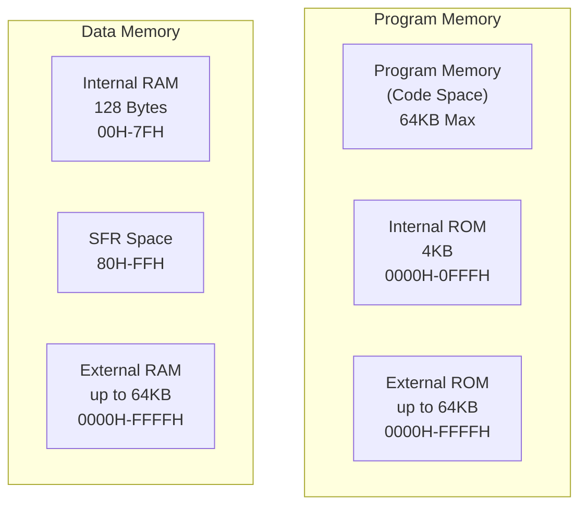

### Internal Data Memory (128 Bytes: 00H–7FH)

```
┌──────────────────────────────┐ 7FH
│   General Purpose RAM        │
│   (Scratch Pad Area)         │ 30H
├──────────────────────────────┤ 2FH
│   Bit-Addressable Area       │
│   (16 bytes = 128 bits)      │ 20H
├──────────────────────────────┤ 1FH
│   Register Bank 3 (R0-R7)   │ 18H
├──────────────────────────────┤ 17H
│   Register Bank 2 (R0-R7)   │ 10H
├──────────────────────────────┤ 0FH
│   Register Bank 1 (R0-R7)   │ 08H
├──────────────────────────────┤ 07H
│   Register Bank 0 (R0-R7)   │ 00H
│   (Default after reset)     │
└──────────────────────────────┘
```

| Region | Address | Description |
|--------|---------|-------------|
| **Register Banks** | 00H–1FH | 4 banks × 8 registers (R0–R7), selected via RS1:RS0 in PSW |
| **Bit-Addressable** | 20H–2FH | 16 bytes (128 bits), individually addressable as bits 00H–7FH |
| **Scratch Pad** | 30H–7FH | 80 bytes of general-purpose RAM |

### SFR Space (80H–FFH)
- Contains all **Special Function Registers** (Accumulator, B, PSW, DPTR, SP, ports, timer registers, etc.)
- Only **directly addressed** (not indirect)
- Some SFRs are bit-addressable (addresses divisible by 8)

### External Data Memory (up to 64KB)
- Accessed via **MOVX** instruction
- Uses **DPTR** (16-bit) or **R0/R1** (8-bit) as pointer
- Requires external address latch (ALE) and data bus

### Program Memory (up to 64KB)
- Internal: 4KB (0000H–0FFFH), selected when EA̅ = 1
- External: up to 64KB, selected when EA̅ = 0 or address > 0FFFH
- Accessed via **MOVC** instruction for look-up tables

---

## Q4(A): Illustrate the Features of the 8051 Microcontroller. (5 Marks)

### Core Features

| Feature | Specification |
|---------|--------------|
| **CPU** | 8-bit processor with Boolean (bit-level) processing |
| **Clock** | 12 MHz max (standard), 1 machine cycle = 12 clock cycles |
| **ROM** | 4KB on-chip (8051); expandable to 64KB external |
| **RAM** | 128 bytes on-chip; expandable to 64KB external |
| **I/O Ports** | 4 bidirectional 8-bit ports (32 I/O lines) |
| **Timers** | Two 16-bit Timer/Counters (T0, T1) |
| **Serial Port** | Full-duplex UART |
| **Interrupts** | 5 interrupt sources, 2 priority levels |
| **Instruction Set** | 111 instructions (49 single-byte, 45 two-byte, 17 three-byte) |

### Detailed Features

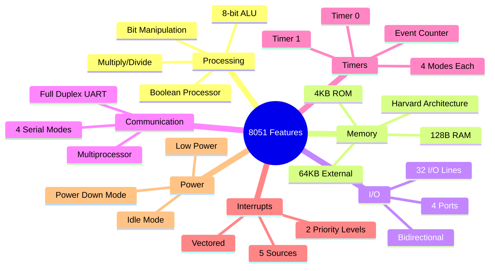

### Key Advantages
1. **Bit-level operations**: Unique Boolean processor for single-bit manipulation
2. **On-chip peripherals**: Reduces external component count
3. **Multiple addressing modes**: Direct, indirect, register, immediate, indexed
4. **Power saving**: Idle and Power-Down modes reduce consumption
5. **Versatile timers**: Can work as timers (internal clock) or counters (external events)
6. **Industry standard**: Large ecosystem of compatible chips (AT89S52, P89V51RD2, etc.)

### Port Alternate Functions (Port 3)

| Pin | Alternate Function |
|-----|-------------------|
| P3.0 | RxD (Serial receive) |
| P3.1 | TxD (Serial transmit) |
| P3.2 | INT0̄ (External interrupt 0) |
| P3.3 | INT1̄ (External interrupt 1) |
| P3.4 | T0 (Timer 0 external input) |
| P3.5 | T1 (Timer 1 external input) |
| P3.6 | WR̄ (External memory write) |
| P3.7 | RD̄ (External memory read) |

---

## Q4(B): A/D Converter Interfacing with 8051. (5 Marks)

### Introduction
An **Analog-to-Digital Converter (ADC)** converts analog voltage to a digital value. The **ADC0804** is a popular 8-bit ADC used with 8051.

### ADC0804 Key Specifications
- 8-bit resolution (256 levels)
- Input voltage range: 0–5V (single-ended)
- Conversion time: ~100 μs
- Successive approximation type

### Interface Diagram

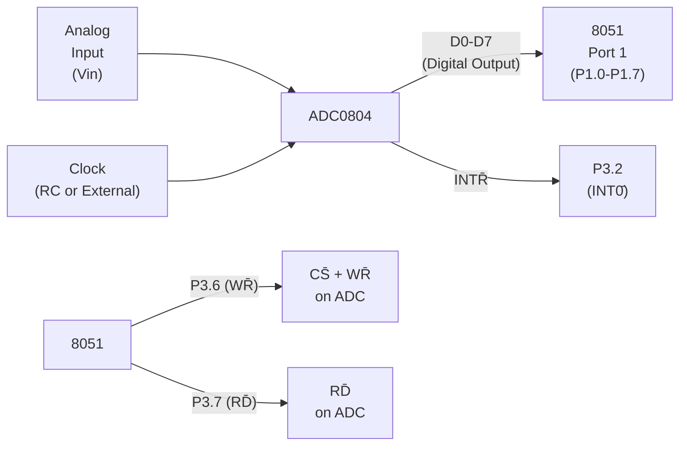

### Pin Connections

| ADC0804 Pin | Connected To | Purpose |
|-------------|-------------|---------|
| D0–D7 | P1.0–P1.7 | Digital data output |
| CS̄ + WR̄ | P3.6 (WR̄) | Start conversion (pulse low) |
| RD̄ | P3.7 (RD̄) | Read converted data |
| INTR̄ | P3.2 (INT0̄) | End-of-conversion signal |
| Vin(+) | Analog input | Signal to be converted |
| Vin(−) | GND | Reference ground |
| CLK R/CLK IN | RC circuit | Internal clock (~606 kHz) |
| Vref/2 | 2.5V or open | Sets input range |

### Assembly Language Program

```asm
; ADC0804 Interfacing with 8051
; Port 1 = Data input from ADC
; P3.6 (WR) = Start conversion
; P3.7 (RD) = Read data
; P3.2 (INT0) = INTR (end of conversion)

        MOV P1, #0FFH     ; Configure Port 1 as input

AGAIN:  CLR P3.6           ; WR̄ = 0 (Start conversion pulse)
        NOP
        SETB P3.6          ; WR̄ = 1 (Conversion begins)

WAIT:   JB P3.2, WAIT      ; Wait until INTR̄ goes LOW
                            ; (conversion complete)

        CLR P3.7           ; RD̄ = 0 (Enable data output)
        MOV A, P1          ; Read digital value from ADC
        SETB P3.7          ; RD̄ = 1 (Disable data output)

        MOV DPTR, #4000H   ; Store result to external memory
        MOVX @DPTR, A      ; or display/process the data

        SJMP AGAIN          ; Repeat continuously
```

### Steps of Operation
1. **Pulse WR̄ low**: Initiates analog-to-digital conversion
2. **Wait for INTR̄**: ADC asserts INTR̄ (low) when conversion is done
3. **Assert RD̄ low**: Enables digital output on D0–D7
4. **Read Port 1**: CPU reads the 8-bit digital result
5. **Process/store**: The value is stored or sent to display

---
---

# UNIT-5: ARM Architecture and Embedded Processors

---

## Q1(A): Draw the Architecture of the ARM Controller and Explain Each Block. (5 Marks)

### Introduction
ARM (Advanced RISC Machines) processors use a **RISC architecture** with a load-store design, fixed-length instructions, and a large register file for high performance at low power.

### ARM Architecture Block Diagram

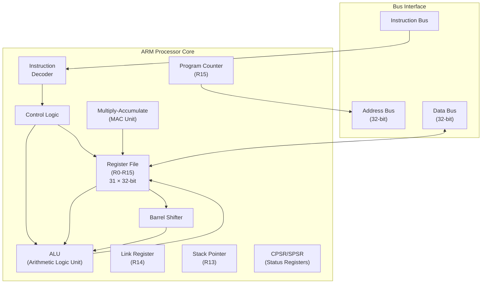

### Block Descriptions

| Block | Function |
|-------|----------|
| **Register File** | 16 visible registers (R0–R15): R0–R12 general purpose, R13 (SP), R14 (LR), R15 (PC). Additional banked registers for each processor mode |
| **ALU** | Performs 32-bit arithmetic (ADD, SUB) and logic (AND, OR, XOR) operations. Updates condition flags (N, Z, C, V) in CPSR |
| **Barrel Shifter** | Performs shift/rotate operations (LSL, LSR, ASR, ROR) in a single cycle — a unique ARM feature allowing shift + ALU in one instruction |
| **MAC Unit** | Dedicated hardware for multiply and multiply-accumulate operations (MUL, MLA) for DSP-like performance |
| **Instruction Decoder** | Decodes 32-bit ARM or 16-bit Thumb instructions and generates control signals |
| **Control Logic** | Manages pipeline stages (Fetch → Decode → Execute), handles interrupts, mode switching |
| **CPSR** | Current Program Status Register: holds N, Z, C, V flags + processor mode + interrupt disable bits |
| **SPSR** | Saved Program Status Register: saves CPSR during exception handling |
| **Address/Data Bus** | 32-bit address bus (4GB addressable), 32-bit data bus for memory access |

### ARM Processor Modes

| Mode | Purpose |
|------|---------|
| User (USR) | Normal program execution |
| FIQ | Fast interrupt handling |
| IRQ | Normal interrupt handling |
| Supervisor (SVC) | OS kernel / reset |
| Abort (ABT) | Memory access faults |
| Undefined (UND) | Undefined instruction trap |
| System (SYS) | Privileged OS tasks |

---

## Q1(B): Compare CISC and RISC Architectures. (5 Marks)

### Comparison Table

| Feature | CISC | RISC |
|---------|------|------|
| **Full Form** | Complex Instruction Set Computer | Reduced Instruction Set Computer |
| **Instructions** | Large set (100–300+), variable complexity | Small set (≈50–100), simple operations |
| **Instruction Length** | Variable (1–15 bytes) | Fixed (typically 32-bit) |
| **Instruction Format** | Multiple formats | Uniform format |
| **Execution Time** | Multi-cycle per instruction | Single cycle per instruction (goal) |
| **Addressing Modes** | Many (12–24 modes) | Few (3–5 modes) |
| **Memory Access** | Any instruction can access memory | Only LOAD/STORE access memory |
| **Registers** | Few GPRs (8–16) | Many GPRs (32+) |
| **Pipelining** | Difficult (variable instruction length) | Easy and efficient |
| **Hardware** | Complex, more transistors for decoder | Simple hardware, more registers |
| **Code Size** | Smaller (complex instructions) | Larger (simple instructions) |
| **Compiler** | Simpler compiler design | Complex, optimizing compiler needed |
| **Power** | Higher power consumption | Lower power consumption |
| **Examples** | Intel x86, 8086, Pentium, AMD | ARM, MIPS, RISC-V, SPARC, PowerPC |

### Architecture Comparison Diagram

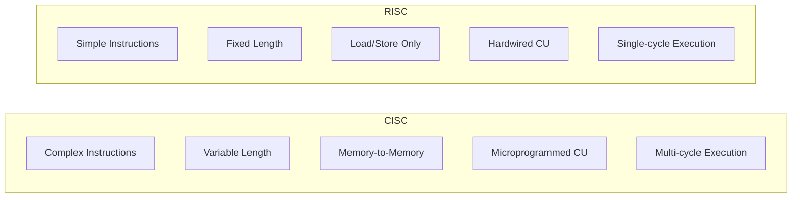

### Key Differences Explained

1. **Instruction Complexity**: CISC has hardware support for complex operations (e.g., string copy in one instruction); RISC breaks these into multiple simple instructions
2. **Memory Model**: CISC allows arithmetic directly on memory operands; RISC requires loading data into registers first (Load-Store architecture)
3. **Pipeline Efficiency**: Fixed-length RISC instructions enable smooth pipelining; variable CISC instructions cause pipeline stalls
4. **Power Efficiency**: RISC's simpler hardware = fewer transistors = lower power → ideal for embedded/mobile (ARM dominates smartphones)
5. **Modern Convergence**: Modern CISC (x86) internally converts complex instructions to RISC-like micro-ops for efficient execution

---

## Q2(A): Explain ARM Cortex-M Series Family in Detail. (5 Marks)

### Introduction
The **ARM Cortex-M** series is a family of 32-bit RISC processor cores designed specifically for **microcontroller** applications. They use the **ARMv6-M** and **ARMv7-M** architecture profiles, optimized for low cost, low power, and real-time embedded systems.

### Cortex-M Family Variants

| Processor | Architecture | Pipeline | Key Features | Applications |
|-----------|-------------|----------|--------------|-------------|
| **Cortex-M0** | ARMv6-M | 3-stage | Smallest ARM core, 56 instructions, low gate count (12K gates) | IoT sensors, simple controllers |
| **Cortex-M0+** | ARMv6-M | 2-stage | Ultra-low power, single-cycle I/O, micro trace buffer | Wearables, energy harvesting |
| **Cortex-M3** | ARMv7-M | 3-stage | Hardware divide, bit-banding, Thumb-2 ISA, NVIC (up to 240 interrupts) | Industrial automation, motor control |
| **Cortex-M4** | ARMv7E-M | 3-stage | DSP extensions (SIMD), optional single-precision FPU | Audio processing, sensor fusion |
| **Cortex-M7** | ARMv7E-M | 6-stage (dual issue) | Instruction/data caches, double-precision FPU, superscalar | High-performance embedded, networking |
| **Cortex-M23** | ARMv8-M (Baseline) | 2-stage | TrustZone security for IoT | Secure IoT endpoints |
| **Cortex-M33** | ARMv8-M (Mainline) | 3-stage | TrustZone + DSP + FPU optional | Secure smart devices |

### Common Features Across Cortex-M

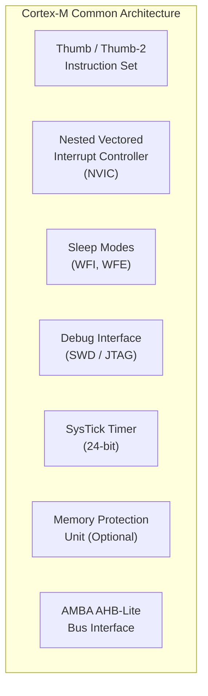

### Key Architectural Features

1. **Thumb-2 Instruction Set**: Mix of 16-bit and 32-bit instructions for code density and performance
2. **NVIC**: Built-in interrupt controller with deterministic latency, tail-chaining, and late arrival handling
3. **SysTick Timer**: 24-bit down-counter for RTOS tick generation
4. **Low Power Modes**: Sleep, Deep Sleep, with WFI/WFE instructions
5. **Memory Map**: Fixed 4GB address space with standard regions (Code, SRAM, Peripheral, External RAM, etc.)
6. **Debug**: Serial Wire Debug (SWD) with 2-pin interface, breakpoints, watchpoints
7. **Bit-Banding**: Atomic bit-level access to SRAM and peripheral registers (M3/M4)

### Cortex-M Performance Comparison

| Feature | M0 | M0+ | M3 | M4 | M7 |
|---------|----|----|----|----|-----|
| DMIPS/MHz | 0.84 | 0.95 | 1.25 | 1.25 | 2.14 |
| FPU | No | No | No | SP (opt) | SP+DP |
| DSP | No | No | No | Yes | Yes |
| Cache | No | No | No | No | Yes |
| TrustZone | No | No | No | No | No |

---

## Q2(B): Explain the Thumb Programming Model of ARM with Examples. (5 Marks)

### Introduction
The **Thumb** instruction set is a **16-bit compressed** version of the 32-bit ARM instruction set. It was introduced to improve **code density** (reduce program memory requirements) while maintaining reasonable performance.

### Evolution

| Version | Instruction Width | Description |
|---------|------------------|-------------|
| **Thumb (v1)** | 16-bit only | Subset of ARM instructions, ~36 instructions |
| **Thumb-2** | 16-bit + 32-bit mixed | Full ARM functionality in Thumb mode, no mode switching needed |

### Thumb vs ARM Comparison

| Feature | ARM State | Thumb State |
|---------|-----------|-------------|
| Instruction size | 32-bit | 16-bit |
| Code density | Lower | ~30% smaller |
| Performance | Higher | Slightly lower |
| Registers accessible | R0–R15 | R0–R7 (high registers limited) |
| Conditional execution | All instructions | Only branches |
| Barrel shifter | Separate operand | Limited |

### Thumb Register Usage

```
┌──────────────────────────────────┐
│  R0-R7: Low Registers            │  ← Fully accessible in Thumb
│  (General Purpose)               │
├──────────────────────────────────┤
│  R8-R12: High Registers          │  ← Limited access in Thumb
├──────────────────────────────────┤
│  R13 (SP): Stack Pointer         │
│  R14 (LR): Link Register        │
│  R15 (PC): Program Counter       │
├──────────────────────────────────┤
│  CPSR: Status Register           │
└──────────────────────────────────┘
```

### Switching Between ARM and Thumb

```asm
; ARM to Thumb: Use BX with bit[0] = 1
    ADR  R0, thumb_code + 1    ; Set bit 0 to indicate Thumb
    BX   R0                     ; Branch and Exchange to Thumb

; Thumb to ARM: Use BX with bit[0] = 0
    LDR  R0, =arm_code          ; Address with bit 0 = 0
    BX   R0                     ; Switch back to ARM
```

### Thumb Instruction Examples

**1. Data Movement:**
```asm
    MOV  R0, #15         ; R0 = 15 (8-bit immediate only)
    MOV  R3, R5          ; R3 = R5
    LDR  R1, [R0]        ; Load word from address in R0
    STR  R2, [R1, #4]    ; Store R2 at address R1+4
```

**2. Arithmetic:**
```asm
    ADD  R0, R1, R2      ; R0 = R1 + R2
    ADD  R0, #100        ; R0 = R0 + 100
    SUB  R3, R4, #7      ; R3 = R4 - 7
    MUL  R0, R1          ; R0 = R0 * R1
    CMP  R0, R1          ; Compare R0 with R1 (sets flags)
```

**3. Logic:**
```asm
    AND  R0, R1          ; R0 = R0 AND R1
    ORR  R0, R1          ; R0 = R0 OR R1
    EOR  R0, R1          ; R0 = R0 XOR R1
    LSL  R0, R1, #3      ; R0 = R1 << 3 (logical shift left)
```

**4. Branch:**
```asm
    B    loop             ; Unconditional branch
    BEQ  equal            ; Branch if equal (Z=1)
    BL   subroutine       ; Branch with Link (saves return address in LR)
```

### Thumb-2 Technology (Modern ARM Cortex-M)

Thumb-2 eliminates the need to switch between ARM and Thumb states by providing:
- **16-bit instructions** for common simple operations (code density)
- **32-bit instructions** for complex operations (performance)
- The processor **automatically decodes** instruction width
- **Cortex-M processors** execute **only Thumb/Thumb-2** (no ARM state)

```asm
; Thumb-2 Example: 32-bit instructions available in Thumb mode
    MOVW R0, #0x1234      ; 32-bit: Load 16-bit immediate into lower half
    MOVT R0, #0x5678      ; 32-bit: Load 16-bit immediate into upper half
                           ; R0 = 0x56781234
    
    IT   EQ                ; If-Then block (conditional execution in Thumb-2)
    ADDEQ R0, R1, R2      ; Executes only if Z=1
```

### Advantages of Thumb
1. **30–40% code size reduction** compared to ARM
2. **Reduced memory cost** — smaller ROM/Flash needed
3. **Better cache utilization** — more instructions fit in cache
4. **Lower power** — fewer memory fetches needed
5. **Ideal for embedded systems** with limited memory
