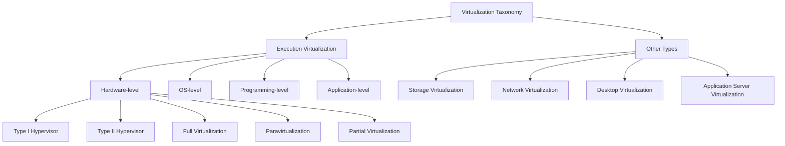
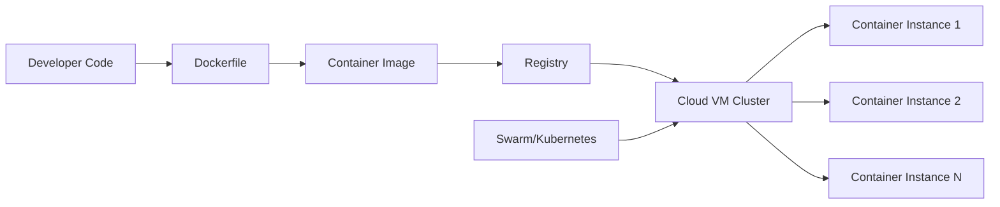
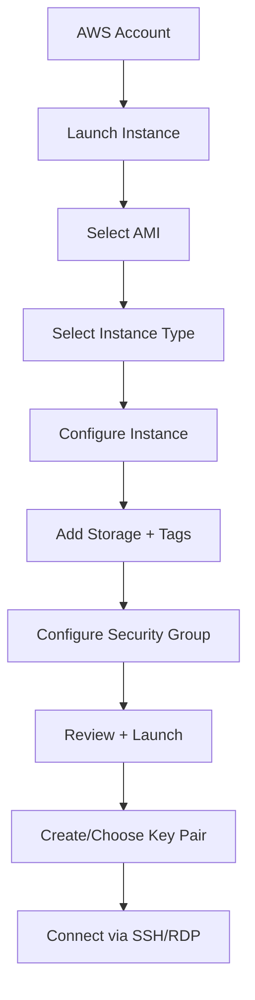
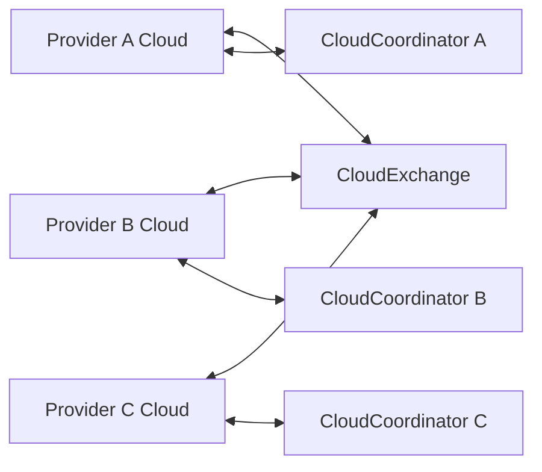
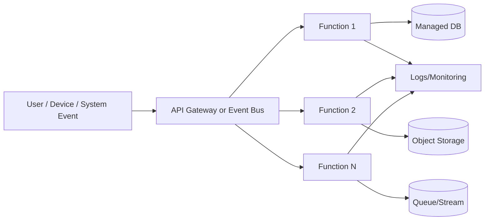
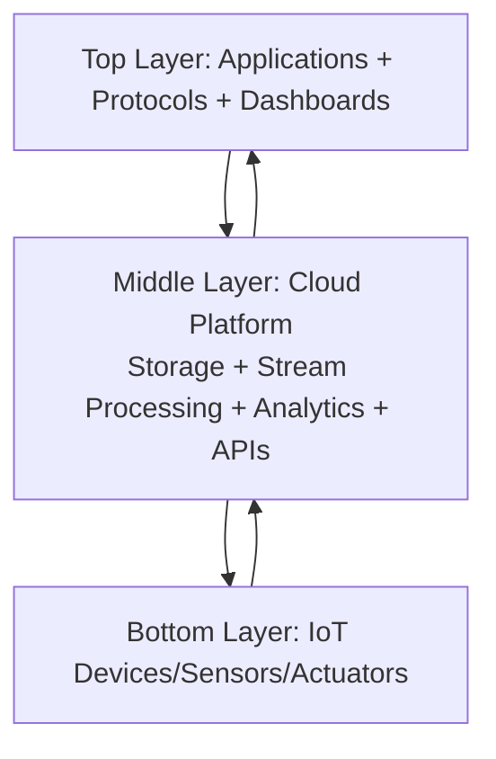

# Cloud Computing - Unit III, IV, V (10-Mark Answers)

This answer sheet is prepared from the provided Unit III, Unit IV, and Unit V slide decks.

---

## Unit III

### 1) Taxonomy of virtualization techniques

Virtualization taxonomy classifies techniques based on which layer of the system is abstracted. In the slides, the major category is **execution virtualization**, along with other forms like storage and network virtualization.

#### A) Execution virtualization

Execution virtualization emulates an execution environment separate from the host environment.

1. **Hardware-level virtualization**

- Uses a hypervisor (VMM) to emulate hardware for guest OSs.
- Hypervisor types:
  - **Type I (native/bare-metal):** runs directly on hardware.
  - **Type II (hosted):** runs on top of a host OS.

2. **Hardware virtualization techniques**

- **Full virtualization:** guest OS runs unmodified on virtual hardware.
- **Paravirtualization:** guest OS is modified to interact efficiently with hypervisor.
- **Partial virtualization:** only part of hardware is virtualized; not all OS features are fully isolated.

3. **Operating system-level virtualization**

- Multiple isolated user spaces (containers) within one OS kernel.
- Lower overhead than hardware virtualization.

4. **Programming language-level virtualization**

- Bytecode-based virtual machines (for example JVM/.NET CLR).
- Strong portability across platforms.

5. **Application-level virtualization**

- Runs specific applications in emulated runtime/library environments.
- Typical techniques: interpretation and binary translation.

#### B) Other virtualization forms

- **Storage virtualization:** pools physical storage into logical storage.
- **Network virtualization:** creates logical networks (for example VLAN) over physical networks.
- **Desktop virtualization:** remote desktop environments hosted in data centers.
- **Application server virtualization:** multiple servers abstracted as one virtual service layer.

#### Diagram: Taxonomy



---

### 2) Short note on VMware

VMware is presented in the slides as a key **full virtualization** technology example.

- VMware replicates underlying hardware and exposes it to guest OS.
- Guest OS runs **unaware of virtualization**, so no OS modification is required.
- Uses:
  - **Type II hypervisors** in desktop scenarios.
  - **Type I hypervisors** in server scenarios.
- Core mechanism:
  - **Direct execution** for non-sensitive instructions.
  - **Binary translation** for sensitive/privileged instructions.
- Strength:
  - Can run unmodified proprietary OSs (for example Windows family).
- Limitation:
  - Runtime binary translation introduces overhead.
- VMware also virtualizes CPU, memory, and I/O devices to provide complete virtual hardware behavior.

---

### 3) Docker container usage in cloud deployment

Docker is an open-source platform to package applications with dependencies into containers for consistent deployment.

#### Why Docker in cloud deployment

- Same container image runs consistently across environments.
- Lightweight compared to VMs because containers share host OS kernel.
- Faster startup and better resource utilization.

#### Cloud deployment flow (from slide points)

1. Build application image (`Dockerfile` -> `docker build`).
2. Store image in registry (`Docker Hub` or private registry).
3. Pull image on cloud hosts.
4. Run containers (`docker run`) and expose networking.
5. Scale with orchestrator (Docker Swarm / Kubernetes).

#### Supporting Docker ecosystem from slides

- **Docker Compose:** multi-container app definition.
- **Docker Machine:** deploy/manage containers on cloud VMs.
- **Docker Stack / Swarm:** cluster-level deployment and orchestration.

#### Diagram: Docker-based cloud deployment



---

### 4) Container orchestration (short)

Container orchestration means automated management of containers across multiple hosts.

Main orchestration responsibilities:

- Scheduling containers to available nodes.
- Service discovery and inter-container networking.
- Auto scaling (up/down) based on load.
- Health checks and restart on failure.
- Rolling updates and rollback.

From slides:

- **Docker Swarm**: turns multiple Docker hosts into one logical host.
- **Kubernetes**: broader orchestration platform; manages containers in pods across a cluster and provides stronger availability and scaling capabilities.

#### Diagram: Orchestration concept

```text
Users -> Service/API -> Orchestrator -> Node A (containers)
                                  -> Node B (containers)
                                  -> Node C (containers)

Orchestrator handles: schedule | scale | recover | update
```

---

### 5) Steps to create an Amazon EC2 instance

Based on the AWS VM slides, the process is:

1. **Create AWS account** and sign in to AWS Console.
2. **Launch a virtual machine** from Console.
3. **Choose AMI** (OS + software template, e.g., Linux/Windows).
4. **Choose instance type** (CPU, memory, networking profile).
5. **Configure instance details** (count, network, host options).
6. **Add storage and tags** (EBS/root volume, metadata labels).
7. **Configure security group** (inbound/outbound firewall rules).
8. **Review and launch** the instance.
9. **Create/select key pair** and download private key.
10. **Connect to instance** (SSH for Linux / RDP for Windows).
11. Verify status in dashboard and start using the VM.

#### Diagram: EC2 creation workflow



---

### 6) Full virtualization

Full virtualization is the ability to run an operating system on a virtual machine **without modifying the guest OS**.

#### Core idea

- VMM/hypervisor provides complete emulation of underlying hardware.
- Guest believes it is running on real hardware.

#### Working principle

- Non-sensitive instructions: directly executed.
- Sensitive/privileged instructions: trapped/translated by VMM.
- Hardware assistance (Intel VT/AMD-V) improves efficiency and isolation.

#### Advantages

- Strong isolation and security.
- Multiple heterogeneous OSs can coexist.
- No need to modify guest OS source code.

#### Limitations

- Extra overhead due to emulation/translation.
- Complex implementation of privileged instruction handling.

#### Example from slides

- VMware is a major full virtualization implementation.

#### Diagram: Full virtualization model

```text
+-------------------------+
| Guest OS + Applications |
+-------------------------+
|  Virtual Hardware (VM)  |
+-------------------------+
| Hypervisor / VMM        |
+-------------------------+
| Physical Hardware       |
+-------------------------+
```

---

## Unit IV

### 1) Cloud interoperability and standards

Cloud interoperability is the ability of services across different cloud providers to work together with minimal friction.

From slides:

- Lack of standards increases **vendor lock-in**.
- Vendor lock-in makes migration expensive and time-consuming.
- Standards and open interfaces reduce lock-in and improve portability.

#### Why standards matter

- Data and workload portability.
- Service-level compatibility.
- Multi-cloud integration.
- Easier federation of providers.

#### Diagram: Interoperability view

```text
Cloud A <---- standard APIs/formats ----> Cloud B <----> Cloud C
           (reduces vendor lock-in)
```

---

### 2) Scalability and fault tolerance

Scalability and fault tolerance are core cloud middleware requirements.

#### Scalability

- Ability to grow beyond in-house limits.
- Dimensions highlighted in slides:
  - performance scaling,
  - size scaling,
  - load scaling.

#### Fault tolerance

- System continues service despite failures.
- Often more important than raw efficiency in real deployments.

#### Combined challenge

Design systems that are:

- highly scalable,
- fault tolerant,
- easy to manage,
- and still performance-competitive.

#### Common approaches

- Redundancy and replication.
- Load balancing.
- Health checks and failover.
- Auto scaling policies.

---

### 3) Federated cloud for combining resources

Federated cloud (InterCloud vision) combines resources of multiple independent clouds.

From slides:

- Federation shares authentication, storage, compute, command/control across providers.
- InterCloud aims for open standards and common deployment understanding.
- Motivation: low latency, demand bursts, scaling beyond local capacity, disaster recovery, and monetizing idle resources.

#### Levels in federation stack

1. **Conceptual level**: motivations, trust, obligations, transparency.
2. **Logical and operational level**: interoperation policies, agreements, negotiation behavior.
3. **Infrastructural level**: technical interoperability among heterogeneous systems.

#### Example technologies in slides

- **RESERVOIR** (dynamic federation, SLA-based IaaS interoperation).
- **InterCloud components**:
  - CloudExchange (market-making/trading),
  - CloudCoordinator (domain-level federation management).

#### Diagram: Federated cloud



---

### 4) Brief note on cloud security

Cloud security concerns in slides center on **security, trust, privacy, and responsibility chains**.

Key points:

- Traditional cryptography helps protect confidentiality and integrity.
- Heavy virtualization introduces new threat surfaces.
- Customer has reduced direct control over data/processes.
- Privacy and legal compliance vary across jurisdictions.
- In multi-party service chains, assigning liability after breach can be difficult.

Hence, secure cloud design must be handled from:

- technical perspective,
- social/trust perspective,
- legal/regulatory perspective.

---

### 5) Resource sharing using cloud shared responsibility model

The shared responsibility idea divides security/operations duties between cloud provider and customer while using shared cloud resources.

#### Provider responsibilities (typical)

- Security **of** the cloud:
  - physical datacenter,
  - core network,
  - hypervisor/platform controls,
  - managed service backbone.

#### Customer responsibilities (typical)

- Security **in** the cloud:
  - IAM/user access,
  - OS and application hardening (IaaS),
  - data encryption/classification,
  - firewall/security group configuration,
  - workload monitoring and patching.

#### How this enables safe sharing

- Multi-tenant infrastructure is safely shared by provider isolation.
- Customer secures tenant-specific configurations and data usage.
- Clear role split reduces overlap gaps and misconfiguration risk.

#### Diagram: Shared responsibility

```text
Provider: Physical/DC + Network + Hypervisor + Managed Platform
Customer: Identity + Data + App + Config + Access Policies

Together -> Secure resource sharing in multi-tenant cloud
```

---

### 6) Security in cloud deployment models (with example)

Security controls differ by deployment model.

#### Public cloud

- Risks: internet exposure, misconfiguration, account compromise.
- Controls: strict IAM, least privilege, security groups, encryption, WAF, continuous monitoring.

#### Private cloud

- Better control/custom policy enforcement.
- Controls: strong internal segmentation, patch governance, centralized logging.

#### Hybrid cloud

- Main challenge: trust boundary and policy consistency.
- Controls: secure VPN/direct links, unified IAM, centralized policy and SIEM.

#### Community cloud

- Shared governance among similar organizations.
- Controls: common compliance baseline and shared audit mechanisms.

#### Example

A company deploys web app in public cloud:

- Uses security groups to allow only ports 80/443.
- Admin access only via VPN + MFA.
- Database in private subnet, encrypted at rest.
- Logs streamed to SIEM for anomaly detection.

---

## Unit V

### 1) Serverless computing

Serverless computing is a cloud execution model where developers deploy code without managing servers.

From slides:

- Closely tied with **FaaS** (Function-as-a-Service).
- Event-driven and auto-scaling.
- Pay-per-use billing.
- Faster development due to reduced operational burden.

#### Benefits

- No server provisioning/management.
- Automatic scaling.
- Reduced operational cost.
- Faster release cycle.

#### Limitations

- Less infrastructure control.
- Cold start latency.
- Vendor lock-in risk.
- Not ideal for long-running workloads.

---

### 2) Architecture of serverless computing and function

Serverless architecture is event-driven: events trigger functions, cloud platform manages runtime/resources.

#### Main components

- Event sources (HTTP/API, queue, DB event, file event).
- API gateway / event router.
- Function runtime (FaaS execution).
- Managed services (DB, storage, messaging).
- Monitoring/logging.

#### Functioning

1. Event occurs.
2. Router invokes function.
3. Function executes business logic.
4. Function reads/writes managed services.
5. Response returned; resources scale automatically.

#### Diagram: Serverless architecture



---

### 3) Serverless vs other computing models (detailed)

| Aspect            | Traditional On-Prem         | IaaS VM Model              | PaaS                       | Serverless (FaaS)                      |
| ----------------- | --------------------------- | -------------------------- | -------------------------- | -------------------------------------- |
| Server management | Full user responsibility    | User manages VM OS/runtime | Platform partly managed    | Provider fully manages execution infra |
| Scaling           | Manual                      | Auto/manual at VM level    | Platform scaling           | Function-level automatic scaling       |
| Billing           | CapEx + fixed infra         | Pay for running VM time    | Pay for platform resources | Pay per invocation + execution time    |
| Deployment unit   | Full app/server             | VM image + app             | App/service package        | Function/event handler                 |
| Startup latency   | Always-on                   | Usually always-on          | Usually always-on          | Can have cold starts                   |
| Best for          | Stable long-running systems | Flexible infra control     | Rapid app hosting          | Event-driven, bursty workloads         |
| Control level     | Highest                     | High                       | Medium                     | Lowest                                 |

#### Interpretation

- Serverless maximizes agility and operational simplicity.
- IaaS gives finer control for custom stacks.
- PaaS balances control and productivity.
- On-prem remains preferred for strict locality/compliance in some cases.

---

### 4) IoT applications and technical relevance

From slides, IoT applications span home, industry, city, health, environment, and logistics domains.

#### Application areas

- Smart homes and building automation.
- Smart cities and e-governance.
- Logistics/supply chain/fleet management.
- eHealth and wearables.
- Smart agriculture and smart watering.
- Smart metering and smart grids.
- Security/emergency management.

#### Technical relevance by category

1. **Monitoring and actuating**

- Sensor data collection through APIs.
- Command-based control of devices.
- Real-time telemetry for operations.

2. **Information gathering and collaborative consumption**

- Social IoT interactions.
- Trust and service discovery through connected entities.

3. **Business process and data analysis**

- Big data analytics/ML for optimization and prediction.
- Benefits at society, industry, organizational, and individual levels.

---

### 5) Need for cloud-centric IoT and layers in live streaming

Cloud-centric IoT is needed because IoT creates massive, bursty, continuous streams that require elastic compute and storage.

From slides:

- Cloud enables batch + stream analytics.
- Pay-as-you-go reduces cost.
- Stream processing engines provide autoscaling and fault tolerance.
- Three-tier cloud-IoT architecture:
  - bottom: IoT devices,
  - middle: cloud provider,
  - top: apps/high-level protocols.

For live streaming use cases (low jitter/latency sensitive), nearest CDN selection and context-aware middleware improve user experience.

#### Diagram: Cloud-centric IoT layered model



---

### 6) DevOps

DevOps combines Development and Operations into a collaborative, automated software delivery practice.

From slides:

- Earlier model: separate teams, manual handoffs, slow releases, frequent errors.
- DevOps model: collaboration + automation + continuous build/test/deploy.
- Typical toolchain mentioned: Git, Jenkins, Docker, Kubernetes.

#### Core outcomes

- Faster release cycles (hours instead of days).
- Better software quality through CI/CD.
- Reduced deployment risk via repeatable automation.
- Shared ownership across development and operations.

#### Diagram: DevOps lifecycle

```text
Plan -> Code -> Build -> Test -> Release -> Deploy -> Operate -> Monitor -> (feedback to Plan)
```

---

## Quick Revision Keywords

- **Unit III:** Hypervisor, full/paravirtualization, Docker, Swarm/Kubernetes, EC2 setup.
- **Unit IV:** Interoperability, vendor lock-in, scalability, fault tolerance, federation, cloud security, shared responsibility.
- **Unit V:** Serverless/FaaS, event-driven architecture, IoT categories, cloud-centric IoT layers, DevOps.
