# SPM Question Bank (Unit III-V) - Comprehensive 10-Mark Answers

This answer bank is prepared from the provided materials:

- `SPM UNIT 3.pdf`
- `spm_unit4.pdf`
- `SPM UNIT 5.pdf`
- `MID 2 Question Bank SPM.docx`

---

## UNIT III

### 1) Explain the Software Architecture from the management perspective.

From a management perspective, software architecture is not only a technical design but also a **project control mechanism**. It aligns business goals, risk, scope, schedule, and team coordination.

1. **Architecture as design concept (intangible):**
   It defines infrastructure, control, and data interfaces so components and teams can collaborate.
2. **Architecture baseline (tangible):**
   It is the cross-section of artifacts proving that the product vision is feasible within cost, time, people, and technology constraints.
3. **Architecture description (human-readable):**
   Organized views that communicate architecture clearly to all stakeholders.
4. **Project milestone significance:**
   A stable architecture marks a major decision point (make/buy, risk containment, planning confidence).
5. **Trade-off platform:**
   It balances problem space (requirements/constraints) and solution space (design/implementation).
6. **Coordination role:**
   It structures communication among developers, architects, managers, users, and external stakeholders.
7. **Risk and predictability:**
   Mature process + demonstrable architecture + requirement understanding are prerequisites for predictable planning.
8. **Failure prevention:**
   Poor architecture and immature process are common root causes of project failure.
9. **Scope for automation:**
   Creative architecture definition cannot be fully automated; it needs engineering judgment.
10. **Management outcome:**
    Better control over schedule, quality, and technical risk through architecture-centered governance.

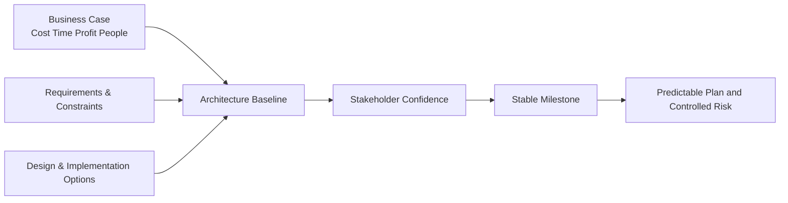

---

### 2) What is a workflow? Explain in detail the process workflows.

A **workflow** is a cohesive, mostly sequential thread of activities mapped to product artifacts. In software process management, top-level workflows ensure every lifecycle concern is addressed continuously.

**Seven top-level process workflows:**

1. **Management workflow:** planning, monitoring, risk control, stakeholder win conditions.
2. **Environment workflow:** process automation, toolchain maintenance, reusable infrastructure.
3. **Requirements workflow:** problem analysis, use-case evolution, requirements artifact refinement.
4. **Design workflow:** architecture/design modeling and technical decision making.
5. **Implementation workflow:** coding, integration, component realization.
6. **Assessment workflow:** quality measurement, defect/metric trend analysis, compliance checks.
7. **Deployment workflow:** transition to user/site/support organization.

**Lifecycle emphasis changes by phase:**

- Inception/Elaboration: management, requirements, architecture-heavy.
- Construction: design, implementation, assessment-heavy.
- Transition: assessment and deployment-heavy.

This phased variation ensures effort is not uniformly distributed but optimized by project maturity.

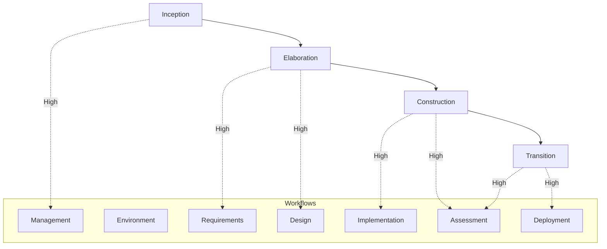

---

### 3) State the heuristics that describe objectively an architecture baseline.

An architecture baseline is considered objective when it is **demonstrable, traceable, measurable, and stakeholder-acceptable**. Practical heuristics are:

1. **Critical use-case coverage exists** and is testable.
2. **Quality objectives are explicit** (performance, reliability, maintainability, etc.).
3. **Architecturally significant classes/components are identified** with clear interfaces.
4. **Concurrency and control strategy is defined** (process/thread relationships).
5. **Implementation inventory exists** (bill of materials of major components).
6. **Executable subset is available** proving key scenarios.
7. **Deployment mapping is explicit** from logical software to physical resources.
8. **Key technical risks are retired or bounded** through prototypes/tests.
9. **Requirements-priority to architecture traceability** is present.
10. **Configuration control is established** for baseline artifacts.
11. **Stakeholder review acceptance** is obtained for milestone readiness.
12. **Business-case alignment** remains valid (cost/schedule feasibility not violated).

These heuristics are used to determine whether architecture is ready to support construction planning with confidence.

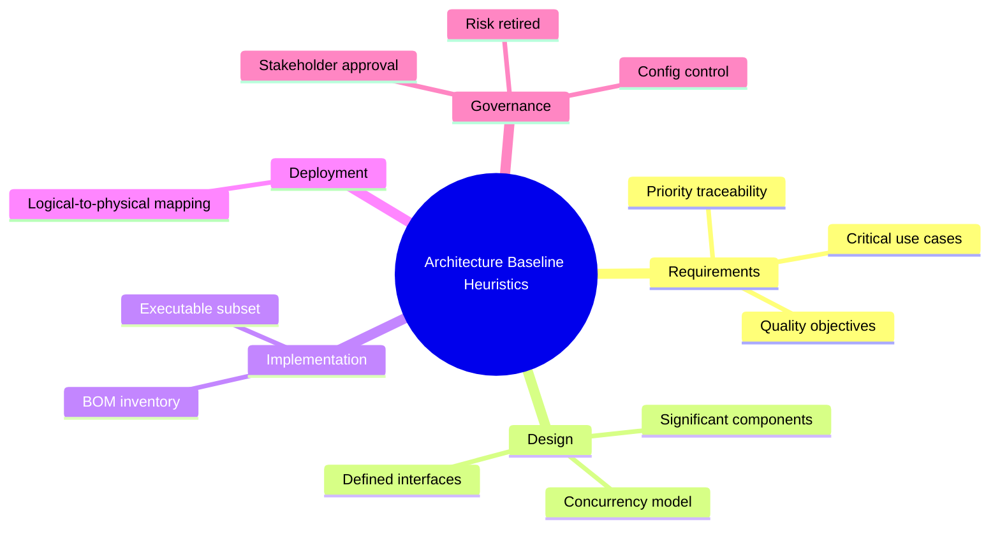

---

### 4) What is a milestone? Explain Major and Minor Milestones with respect to the software process.

A **milestone** is a formally recognized checkpoint used to evaluate progress, quality, and readiness to proceed.

## Major milestones (phase-end, system-wide)

1. **Life-Cycle Objectives (end of Inception):** validates scope, business case, feasibility, cost/schedule estimates.
2. **Life-Cycle Architecture (end of Elaboration):** validates executable architecture and risk retirement.
3. **Initial Operational Capability (late Construction):** evaluates readiness for transition/acceptance testing.
4. **Product Release (end of Transition):** confirms product completion and handover/support readiness.

**Purpose:** synchronize engineering and management views; secure stakeholder authorization for next phase.

## Minor milestones (iteration-level)

1. **Iteration Readiness Review (start):** confirms plan, iteration goals, and evaluation criteria.
2. **Iteration Assessment Review (end):** checks objective achievement, test outcomes, rework needs, and next iteration impact.

**Purpose:** maintain short-cycle control and enable iterative corrections.

## Status assessments

Periodic (monthly/quarterly) management snapshots track trend health in progress, quality, risks, and issues.

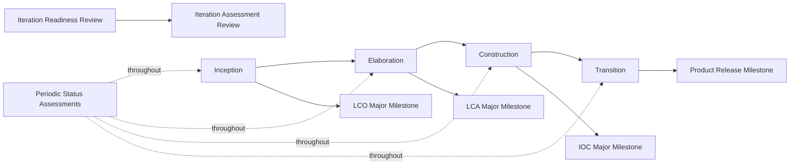

---

### 5) Elaborate on the Iteration Planning Process with a neat diagram.

Iteration planning converts lifecycle intent into executable short-term commitments.

1. **Start from baseline inputs:** current plan, architecture baseline, requirements baseline, open change items.
2. **Select iteration scope:** allocate usage scenarios/use cases for this iteration.
3. **Define evaluation criteria:** measurable acceptance conditions for iteration closure.
4. **Decompose into tasks/work packages:** management, requirements, design, implementation, assessment, deployment activities.
5. **Estimate effort and schedule:** task durations, resource loading, dependencies.
6. **Assign ownership:** role-based and skill-based responsibility allocation.
7. **Risk-first ordering:** prioritize high-risk/high-payoff items early.
8. **Integrate with change management:** baseline updates and software change order alignment.
9. **Plan integration/test strategy:** early and continuous integration checkpoints.
10. **Readiness review:** approve iteration plan and authorize execution.
11. **Execute and monitor:** track metrics and issue trends.
12. **Assessment review:** capture outcomes and feed next iteration plan.

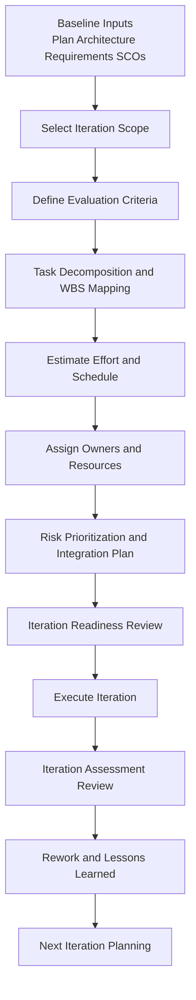

---

### 6) Define iteration. Discuss the sequence of activities in an iteration workflow.

An **iteration** is a time-boxed development cycle that produces an intermediate, demonstrable result and updates the evolving baseline.

**Typical sequence of iteration workflow activities:**

1. **Management:** plan iteration content and assign tasks.
2. **Environment:** update change-order/baseline environment artifacts.
3. **Requirements:** elaborate allocated use cases and update requirement artifacts.
4. **Design:** evolve architecture and design model for allocated criteria.
5. **Implementation:** build/acquire/modify components; integrate with existing baselines.
6. **Assessment:** evaluate compliance with criteria and product/process quality.
7. **Deployment:** release to user/external stakeholder or close internally with post-mortem.

**Phase-wise emphasis:**

- Early iterations: management + requirements + design.
- Mid lifecycle: design + implementation + assessment.
- Late lifecycle: assessment + deployment.

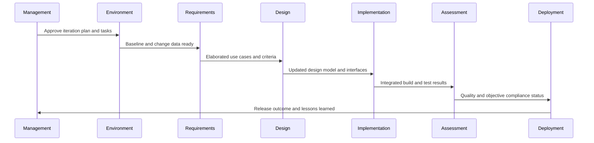

---

## UNIT IV

### 7) Explain the roles and responsibilities of the default line-of-business organization.

A software line-of-business (LoB) organization provides common process capability across projects.

**Core roles and responsibilities:**

1. **SEPA (Software Engineering Process Authority):**
   Maintains process maturity roadmap, guides process usage, and institutionalizes best practices.
2. **PRA (Project Review Authority):**
   Ensures projects comply with organizational policies, standards, and contractual expectations.
3. **SEEA (Software Engineering Environment Authority):**
   Automates process, maintains standard environments, trains projects, and sustains reusable assets.
4. **Infrastructure function:**
   Provides organization-wide support assets (HR, R&D support, reusable engineering capability).
5. **Process definition and maintenance ownership:**
   Centralized and coherent across LoB.
6. **Process automation as first-class role:**
   Equal in importance to process definition.
7. **Support for project reuse and consistency:**
   Enables economies of scale and ROI.
8. **Cross-project governance:**
   Enforces common lifecycle checkpoints, metrics, and compliance mechanisms.

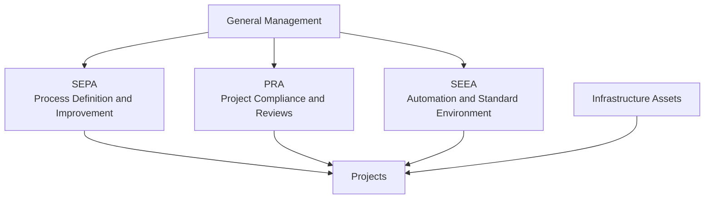

---

### 8) What is Automation? Explain the building blocks for process automation.

In SPM context, **automation** is the systematic use of integrated tools and environments to execute process activities with speed, consistency, traceability, and lower cost of change.

**Why automation is essential:**

1. Iterative development requires frequent change.
2. Manual change handling increases resistance and defects.
3. Metrics automation improves project control.
4. Round-trip engineering needs consistent artifact synchronization.

**Three automation levels:**

1. **Metaprocess (LoB):** infrastructure-level automation.
2. **Macroprocess (Project):** project environment automation.
3. **Microprocess (Iteration):** tool-level automation.

**Workflow-wise building blocks:**

1. Management: workflow and metrics automation.
2. Environment: change and document automation.
3. Requirements: requirements management tools.
4. Design: visual modeling tools.
5. Implementation: editor/compiler/debugger/linker/runtime.
6. Assessment: test automation and defect tracking.
7. Deployment: release/deployment and defect-tracking support.

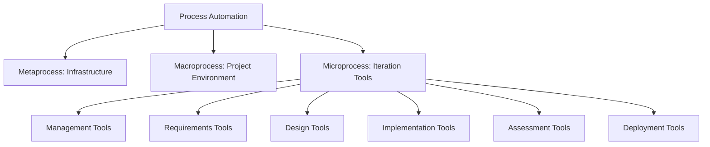

---

### 9) Illustrate the software project team evolution over the life cycle.

Project teams evolve phase-wise; emphasis shifts across management, architecture, development, and assessment.

**Typical evolution profile:**

1. **Inception:**
   Management dominant (vision, business case, planning).
2. **Elaboration:**
   Architecture dominant (risk retirement, executable architecture).
3. **Construction:**
   Development dominant (component realization and integration).
4. **Transition:**
   Assessment dominant (quality validation, deployment readiness, acceptance focus).

**Illustrative allocation from the material:**

- Inception: Mgmt 50%, Arch 20%, Dev 20%, Assess 10%
- Elaboration: Mgmt 10%, Arch 50%, Dev 20%, Assess 20%
- Construction: Mgmt 10%, Arch 10%, Dev 50%, Assess 30%
- Transition: Mgmt 10%, Arch 5%, Dev 35%, Assess 50%

This dynamic allocation improves resource efficiency and avoids misaligned staffing.

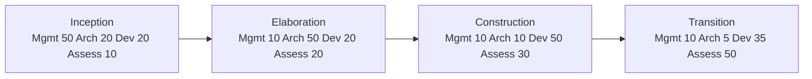

---

### 10) Explain about the four Quality indicators used in the software process.

Quality control in iterative SPM is tracked through practical indicators that expose product and process health.

**Four important quality indicators:**

1. **Defect Trend Indicator**
   - Tracks defect arrival, closure, leakage, severity mix.
   - Indicates whether quality is improving per iteration.

2. **Requirements Compliance Indicator**
   - Measures fulfillment of allocated use cases and acceptance criteria.
   - Ensures delivered functionality matches stakeholder intent.

3. **Baseline Stability / Change Indicator**
   - Uses change-order volume, rework load, and configuration churn.
   - High churn late in lifecycle signals instability and risk.

4. **Test and Assessment Effectiveness Indicator**
   - Coverage, pass rate, regression success, escaped defects.
   - Reflects trustworthiness of verification process.

**Use in management:**

- Combined analysis enables go/no-go decisions at iteration and phase checkpoints.
- Quality ownership is distributed across teams, but indicators provide shared objective evidence.

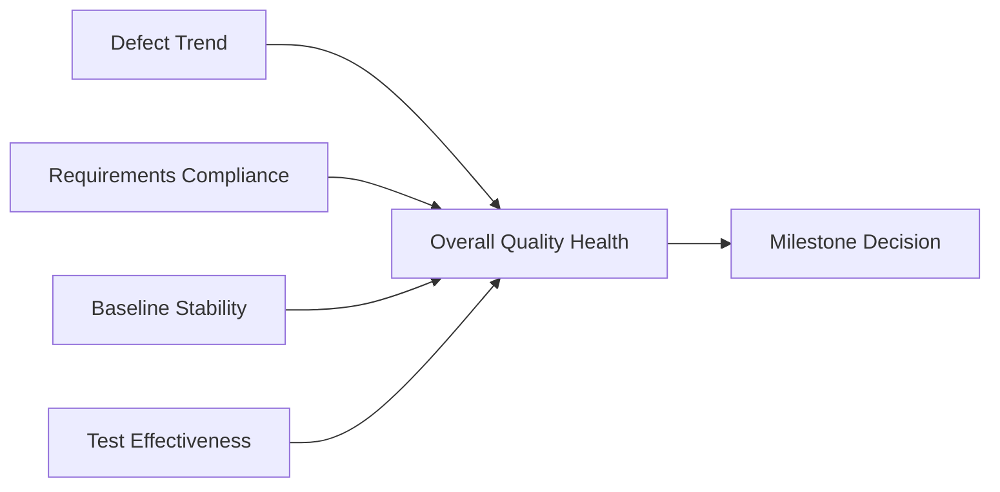

---

### 11) Explain in detail the default project organization and responsibilities.

The default project organization separates concerns while preserving collaboration.

**Main organizational groups and responsibilities:**

1. **Software Management Team**
   - Business case, software development plan, status assessments.
   - Planning, monitoring, risk management, customer/PRA interface.

2. **Software Architecture Team**
   - Owns architecture artifacts and integration direction.
   - Handles global design decisions and architectural integrity.

3. **Software Development Team**
   - Component construction, integration contributions, maintenance.

4. **Software Assessment Team**
   - Independent evaluation, testing, quality trend reporting.

5. **Administration / Supporting functions**
   - Process support, repository governance, coordination services.

**Key principles:**

1. PM team is an active producer, not just supervisor.
2. Architecture team owns real deliverables, not advisory-only role.
3. Assessment remains organizationally separate from development.
4. Quality is everyone’s responsibility at all checkpoints.
5. Each team contributes a different quality perspective.

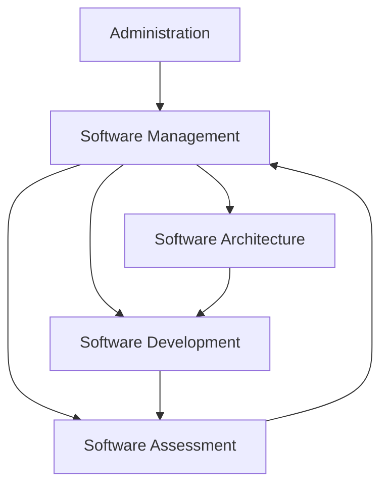

---

### 12) Give the Seven Core metrics that are used in managing the software process.

Seven core metrics commonly used to manage iterative software process are:

1. **Progress / Schedule variance**
   - Planned vs actual completion trend.
2. **Effort / Cost variance**
   - Budgeted vs consumed effort/cost.
3. **Product size / growth**
   - Use-case count, feature points, code growth trend.
4. **Change traffic and breakage**
   - Number/type of SCOs, churn rate, rework intensity.
5. **Defect metrics**
   - Open/closed defects, defect density, severity trend.
6. **Test effectiveness metrics**
   - Coverage, pass rates, regression stability.
7. **Milestone/quality readiness metrics**
   - Degree of objective satisfaction for iteration/phase exit.

**Why these seven matter:**

- Together they connect scope, time, cost, quality, and risk.
- They support proactive correction, not post-failure reporting.
- They provide objective evidence for status assessments and milestone reviews.

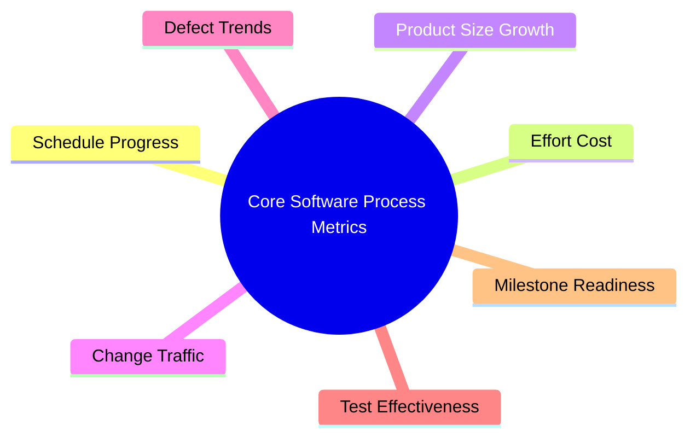

---

### 13) What is round trip engineering? Explain.

**Round-trip engineering** is integrated environment support that keeps different engineering artifacts consistent and traceable through continuous bidirectional updates.

1. In iterative development, artifacts evolve rapidly (requirements, design, code, tests).
2. Manual synchronization causes mismatch and errors.
3. Round-trip support propagates controlled changes across artifacts.
4. It increases change freedom while preserving baseline integrity.
5. It works with change management (SCOs), configuration baselines, and CCB decisions.
6. It reduces transition overhead from one artifact set to another.
7. It improves accuracy of metrics and reporting because data remains aligned.
8. It is essential in modern tool-integrated project environments.

**Associated disciplines:**

- Change management automation
- Configuration management and baselines
- Organization/project/stakeholder environment integration

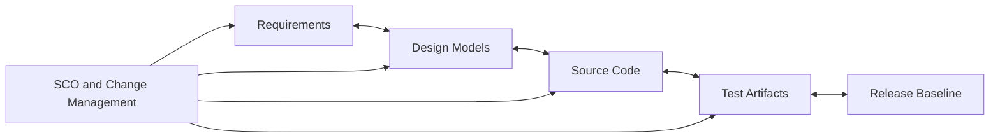

---

## UNIT V

### 14) What is Agile methodology? Explain the properties of Agile methodology.

Agile methodology is an **iterative and incremental** development approach delivering working software in short cycles (typically 1-4 weeks), with continuous customer feedback.

**Core properties:**

1. **Short iterations:** rapid increments and frequent value delivery.
2. **Adaptability:** welcomes requirement changes based on business evolution.
3. **Customer-centricity:** frequent interaction and feedback loop.
4. **Incremental delivery:** workable product at each iteration.
5. **Cross-functional teamwork:** collaborative team structure.
6. **Role clarity:** Scrum Master (facilitation), Product Owner (value/priorities), team (execution).
7. **Inspect and adapt:** demos, reviews, retrospectives.
8. **Empirical control:** decisions based on observed outcomes and metrics.
9. **Continuous improvement:** iterative process refinement.
10. **Reduced delivery risk:** smaller batches reduce release uncertainty.

Compared to single-phase long-cycle models, Agile improves responsiveness and delivery cadence.

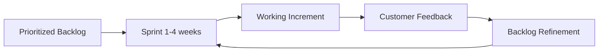

---

### 15) What is DevOps? Explain the DevOps delivery pipelining.

DevOps is a collaborative culture and engineering practice that unifies development and operations to deliver software faster, more reliably, and with continuous feedback.

## DevOps delivery pipeline

A DevOps pipeline is an automated flow from code commit to production operation.

1. **Source control:** versioned change management.
2. **Build/CI:** automatic build and integration checks.
3. **Automated testing:** functional, regression, quality gates.
4. **Deployment automation:** promote build across environments.
5. **Containerization:** consistency across dev/test/prod.
6. **Configuration management:** repeatable environment setup.
7. **Monitoring/logging:** health and performance visibility.
8. **Feedback loops:** production insights feed planning and coding.
9. **Manual gates (where needed):** controlled approvals for high-risk steps.

**Outcome:** faster time-to-market, reduced failure risk, improved quality.

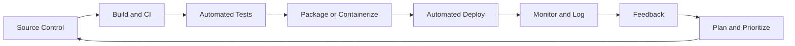

---

### 16) What is SCRUM model? Focus on its cycles.

Scrum is an Agile framework for incremental product development through time-boxed sprints and empirical process control.

## Scrum cycles

1. **Product Backlog Creation:** Product Owner prioritizes value-focused items.
2. **Sprint Planning:** team selects sprint scope and defines sprint goal.
3. **Sprint Execution (1-4 weeks):** build/test/integrate sprint backlog.
4. **Daily Scrum:** short synchronization for progress, blockers, next actions.
5. **Sprint Review:** demonstrate increment and gather stakeholder feedback.
6. **Sprint Retrospective:** inspect team process and define improvements.
7. **Backlog Refinement:** update priorities and prepare next sprint.

**Roles in the cycle:**

- Product Owner: value/prioritization and acceptance.
- Scrum Master: facilitation and impediment removal.
- Cross-functional Team: delivery ownership.

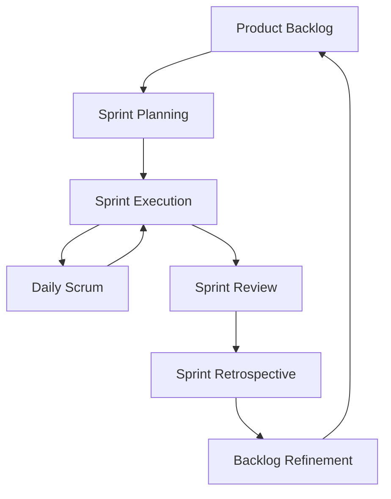

---

### 17) Explain the tools that support implementation of DevOps.

DevOps implementation requires an integrated toolchain spanning the full lifecycle.

1. **Version Control (Git, Subversion):** source history, branching, collaboration.
2. **CI/CD tools (Jenkins, GitLab CI, Travis CI, TeamCity, Bamboo):** build-test-deploy automation.
3. **Container and orchestration (Docker, Kubernetes):** portability and scalable runtime.
4. **Configuration management (Ansible, Puppet, Chef):** infra consistency and reproducibility.
5. **Infrastructure as Code (Terraform, CloudFormation):** programmable environments.
6. **Monitoring/logging (Splunk, Nagios, ELK):** observability and incident response.
7. **Quality/security tools (SonarQube, DevSecOps tools):** code quality and secure delivery.
8. **Planning/collaboration tools (Jira, Trello):** workflow visibility and coordination.

**Tool selection principles:**

- Integration compatibility
- Automation depth
- Scalability
- Team skill fit
- Business alignment and governance needs

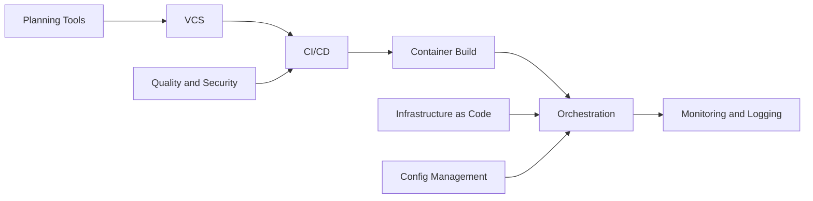

---

### 18) Give the significance of various components of DevOps ecosystem.

The DevOps ecosystem is a connected set of practices/tools that enables end-to-end software delivery excellence.

**Significance of key components:**

1. **VCS:** single source of truth for code evolution and collaboration.
2. **CI/CD:** reduces integration risk and accelerates release frequency.
3. **Configuration Management:** stable and repeatable environments.
4. **Containerization:** environment consistency and deployment portability.
5. **Monitoring and Logging:** operational visibility and faster recovery.
6. **Collaboration/Planning platforms:** shared priorities and transparent execution.
7. **IaC:** rapid, auditable, scalable infrastructure provisioning.
8. **DevSecOps:** integrates security early, reducing late-stage vulnerabilities.

**Overall significance:**

- Converts SDLC into continuous flow.
- Improves quality, speed, reliability, and governance.
- Aligns technical delivery with business outcomes.

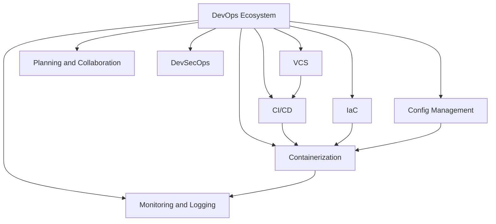

---

### 19) Mention some of the core benefits of DevOps.

Core DevOps benefits include:

1. **Faster time-to-market** through automation and continuous delivery.
2. **Improved collaboration** between development and operations.
3. **Higher delivery efficiency** by removing repetitive manual tasks.
4. **Better software quality** with frequent integration and testing.
5. **Better resource utilization** via cloud and programmable infrastructure.
6. **Higher customer satisfaction** due to frequent reliable updates.
7. **Lower release risk** through smaller and more frequent changes.
8. **Continuous improvement culture** enabled by fast feedback loops.
9. **Reduced defect and regression overhead** in mature pipelines.
10. **Operational stability** from monitoring, logging, and controlled releases.

These benefits are cumulative; strongest gains appear when culture, process, and tools are transformed together.

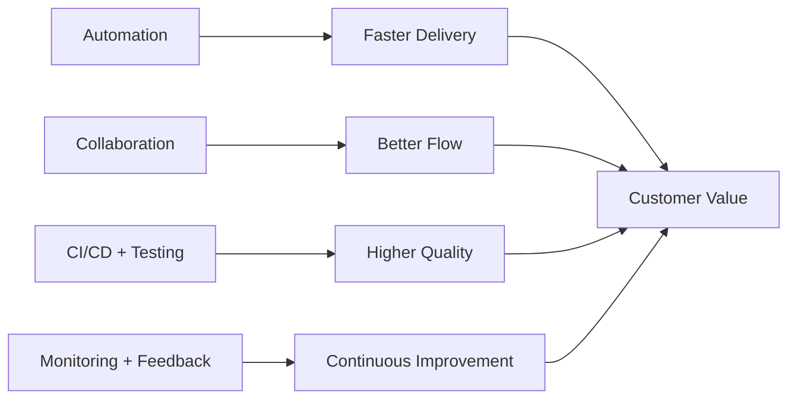

---

### 20) Explain the difference between the traditional Waterfall model and the Agile model.

Waterfall and Agile differ fundamentally in planning style, delivery cadence, and change handling.

1. **Lifecycle structure**
   - Waterfall: linear, phase-by-phase.
   - Agile: iterative and incremental.

2. **Requirements handling**
   - Waterfall: mostly fixed early.
   - Agile: evolving via continuous feedback.

3. **Delivery pattern**
   - Waterfall: usually one major release.
   - Agile: frequent working increments (1-4 week cycles).

4. **Risk management**
   - Waterfall: risk may surface late.
   - Agile: early and repeated risk exposure/reduction.

5. **Customer involvement**
   - Waterfall: limited at phase boundaries.
   - Agile: continuous collaboration.

6. **Testing approach**
   - Waterfall: heavy testing near end.
   - Agile: continuous testing each iteration.

7. **Team mode**
   - Waterfall: function-siloed roles.
   - Agile: cross-functional self-organizing teams.

8. **Response to change**
   - Waterfall: change is expensive and disruptive.
   - Agile: change is expected and managed.

9. **Planning horizon**
   - Waterfall: long upfront planning.
   - Agile: rolling-wave planning.

10. **Best fit**

- Waterfall: stable requirements, compliance-heavy contexts.
- Agile: dynamic requirements, rapid innovation contexts.

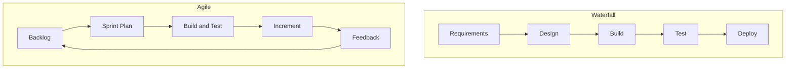

---

## End Note for Exam Writing

For 10-mark answers, use this structure in the exam:

1. Definition/introduction (1 mark)
2. Core explanation with headings (5-6 marks)
3. Diagram + labeling (2 marks)
4. Conclusion/importance (1-2 marks)

This pattern improves clarity and scoring consistency.
